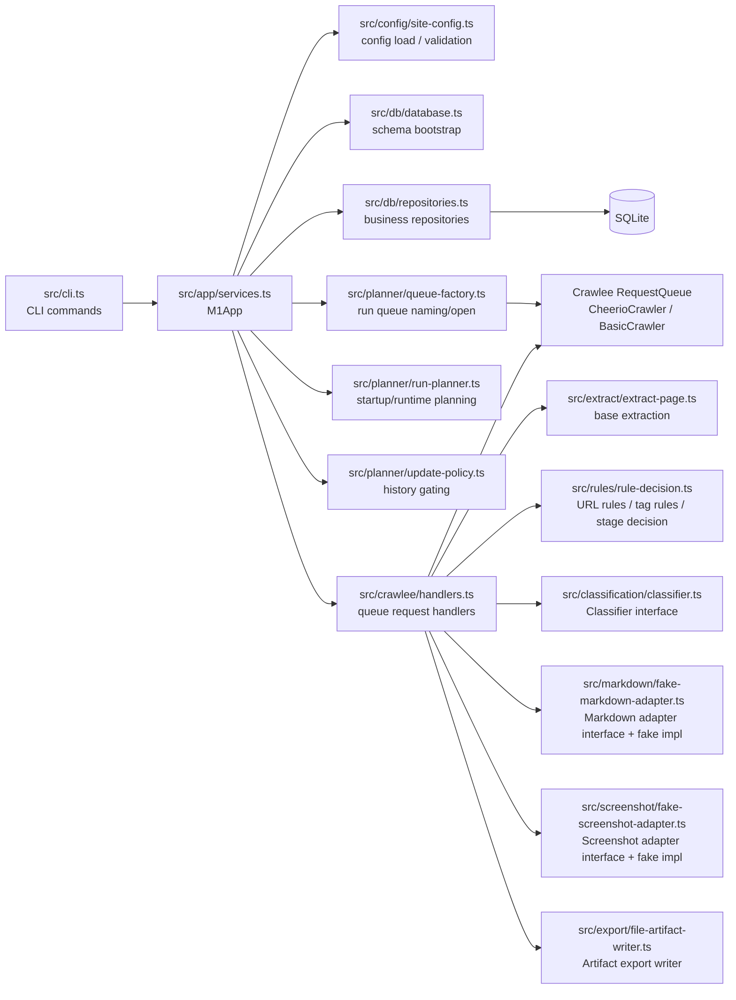
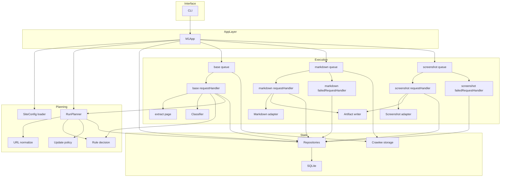
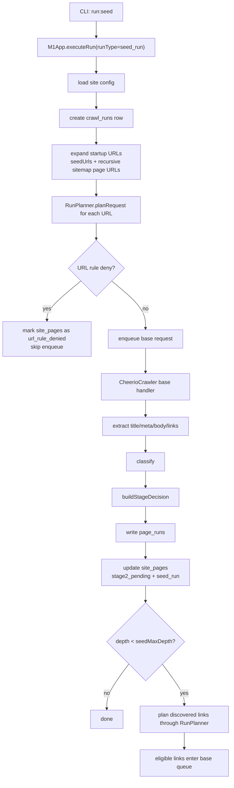
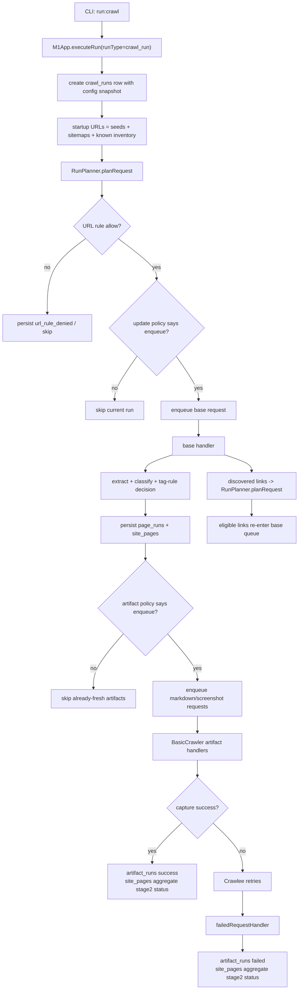
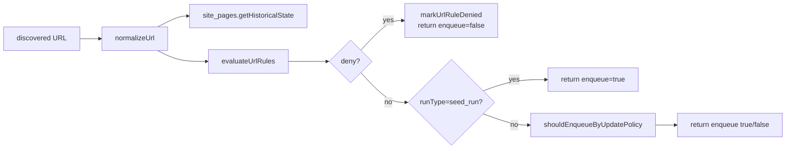
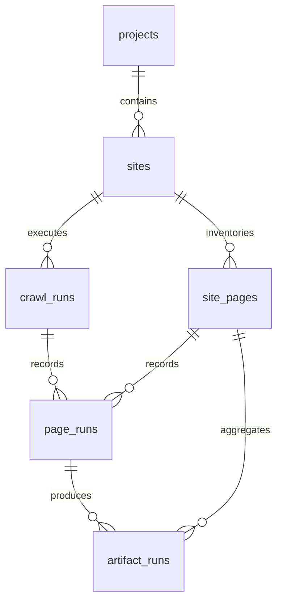
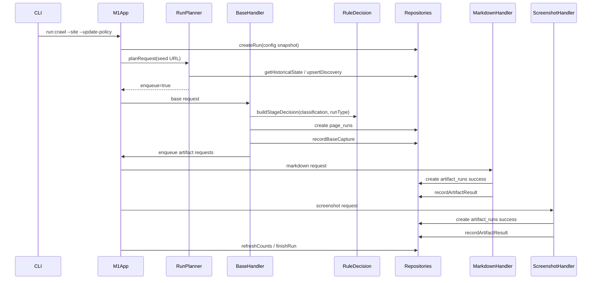

# M1 Current Implementation

## Purpose

This document describes the actual internal implementation shape of M1 after completing `m1-dev-plan.md` Phase 1 / Phase 2 / Phase 3.

It is implementation-oriented:

- what modules exist now
- how requests move through the system
- how SQLite and Crawlee divide responsibilities
- what is intentionally still missing

This document should be read together with:

- `docs/m1-architecture.md`: target architecture and rules
- `docs/m1-dev-plan.md`: phased delivery plan

## High-Level Module Map

## Responsibility Boundaries

### CLI and application service

- `src/cli.ts` only parses commands and flags.
- `src/app/services.ts` is the orchestration entry point for all operator workflows.
- `M1App` owns:
  - DB open / schema init
  - repository construction
  - run creation
  - startup URL expansion
  - crawler and queue wiring
  - inventory read APIs used by CLI

### Planning and decisions

- `src/config/site-config.ts` validates and loads `SiteConfig`.
- `src/rules/rule-decision.ts` handles:
  - fixed-precedence evaluation for `rulesBeforeBaseEq`
  - fixed-precedence evaluation for `rulesBeforeStage2Eq`
  - final stage decision for `seed_run` vs `crawl_run`
- `src/planner/run-planner.ts` is the enqueue gate:
  - normalize URL
  - upsert / find `site_pages`
  - evaluate `rulesBeforeBaseEq`
  - for `crawl_run`, apply update policy
- `src/planner/update-policy.ts` evaluates historical eligibility for:
  - `force_recrawl_all`
  - `skip_existing`
  - `stale_after_duration`

### Crawlee execution seam

- `src/crawlee/handlers.ts` is the main Crawlee-side business seam.
- `createBaseRequestHandler` does:
  - base extraction
  - classification
  - evaluate `rulesBeforeStage2Eq`
  - `page_runs` write
  - `site_pages` status update
  - artifact enqueue for `crawl_run`
  - runtime-discovered URL planning
- `createMarkdownRequestHandler` and `createScreenshotRequestHandler` do capture, export, and success persistence.
- queue-specific `failedRequestHandler`s record the final failed artifact attempt after Crawlee retries are exhausted.

### Persistence

- `src/db/database.ts` creates the schema.
- `src/db/repositories.ts` owns all SQLite business writes and read models.
- Current read paths come from SQLite only, not Crawlee internals.

## Internal Module Relationship Diagram

## Runtime Flow: Seed Run

Current implementation uses `M1App.runSeed(siteId)`.

Key behavior:

- `run_type = seed_run`
- `update_policy = force_recrawl_all`
- base queue runs
- markdown/screenshot queues are created but not executed
- pages that would otherwise be `allow` become `pending` with `pending_reason = seed_run`

## Runtime Flow: Crawl Run

Current implementation uses `M1App.runCrawl(...)`.

Key behavior:

- startup candidates come from:
  - `seedUrls`
  - recursively resolved sitemap page URLs
  - existing `site_pages` inventory
- runtime-discovered URLs go through the same planner path
- `crawl_run` may enqueue markdown/screenshot requests
- base, markdown, and screenshot are executed sequentially:
  - base crawler first
  - markdown crawler second
  - screenshot crawler third

## Planning Logic Detail

### Startup and runtime planning share the same gate

Both paths use `RunPlanner.planRequest(...)`.

### Update policy behavior as implemented

- `force_recrawl_all`
  - always enqueue
- `skip_existing`
  - skip when base and every required artifact already succeeded
  - enqueue when base is missing, pending, failed, or any required artifact is missing/failed
- `stale_after_duration`
  - enqueue when base is stale
  - enqueue when a required artifact is stale

## SQLite Business Model

Current schema:

- `projects`
  - logical grouping
- `sites`
  - config boundary and storage root
- `crawl_runs`
  - run metadata and counters
- `site_pages`
  - durable inventory row per normalized URL
- `page_runs`
  - Stage 1 result per page per run
- `artifact_runs`
  - per-artifact execution result per page per run

## Sequence Diagram: One Allowed Crawl Page

## What Is Implemented Versus Deferred

### Implemented now

- project/site creation
- site config import and clone
- config validation for seed URLs, sitemaps, `rulesBeforeBaseEq`, `rulesBeforeStage2Eq`, and run options
- seed-run flow
- crawl flow with history-aware planning
- runtime link discovery through the same planner path
- markdown/screenshot artifact execution
- exported artifact files with stored `output_path`
- SQLite-backed inventory query commands

### Still deferred or partial

- resume semantics for interrupted run
- stop when `target_success_count` is reached
- full run status / site status operational commands
- real classifier and real capture-tool integrations

## Practical Read Order For Current Code

If you want to understand the code quickly, read in this order:

1. `src/cli.ts`
2. `src/app/services.ts`
3. `src/planner/run-planner.ts`
4. `src/rules/rule-decision.ts`
5. `src/crawlee/handlers.ts`
6. `src/db/repositories.ts`
7. `src/db/database.ts`

That sequence follows the real runtime call chain.
