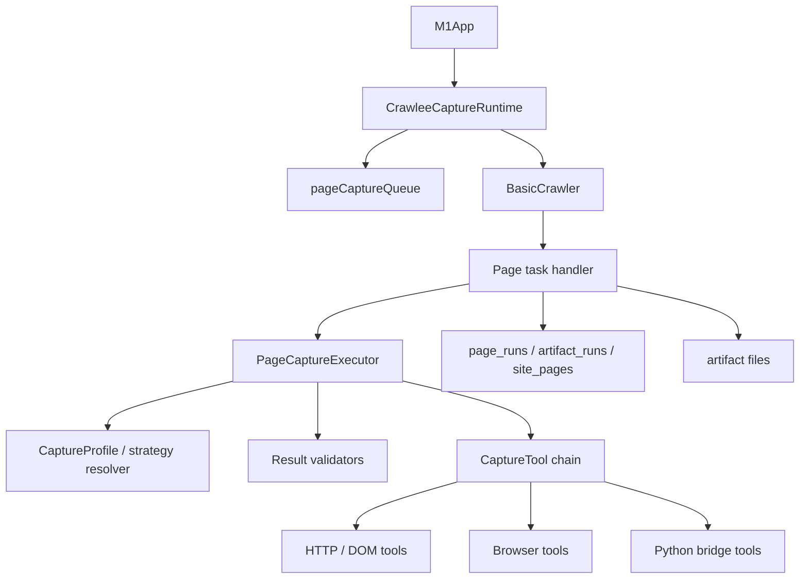
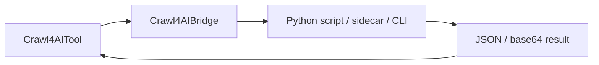
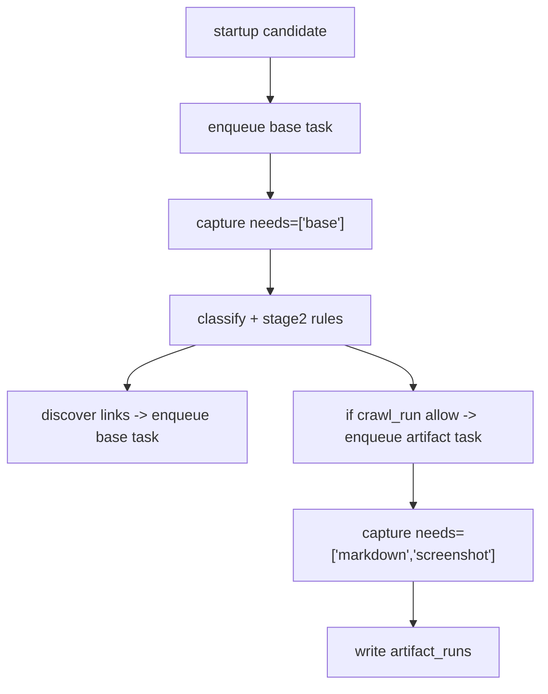
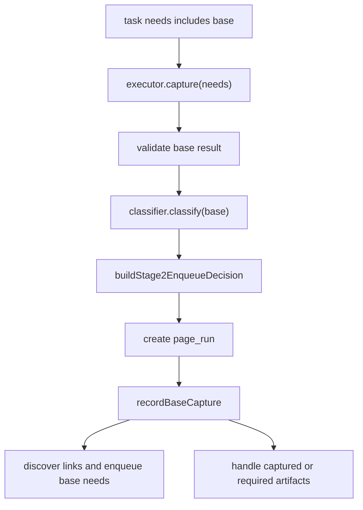
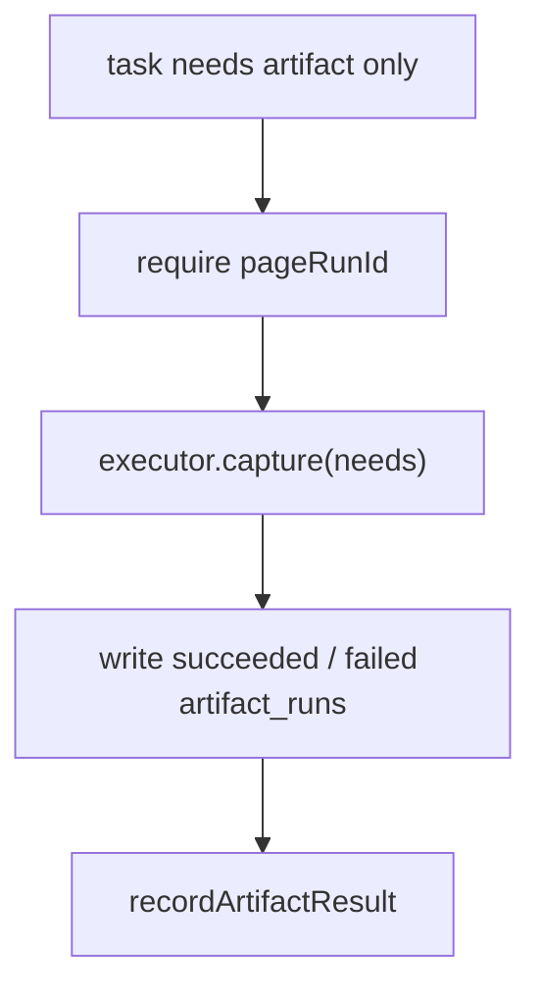
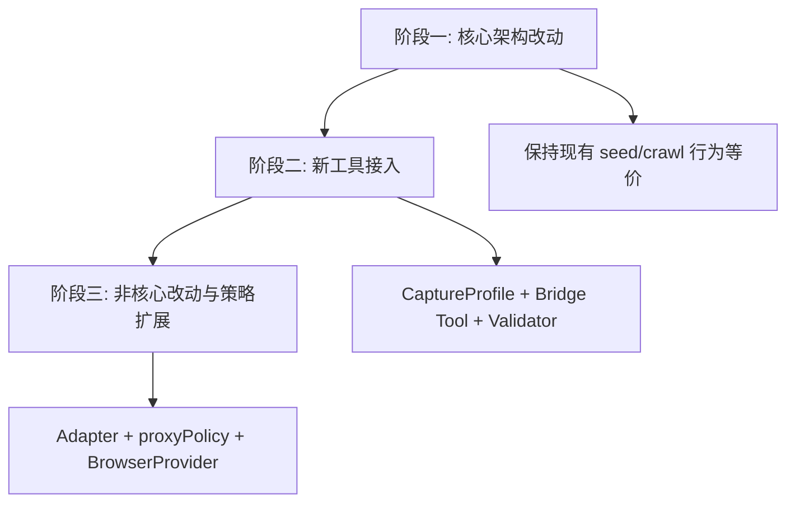

# 爬虫能力升级目标架构设计

本文记录 Milestone2 爬虫能力升级的目标设计。它只描述架构方向和模块边界，不包含执行计划。

## 1. 背景与核心结论

当前项目把 Crawlee 同时用作：

- run 内临时队列和并发调度器
- HTTP 页面抓取器（`CheerioCrawler`）
- DOM 页面抓取器（`LinkeDOMCrawler`）
- 浏览器页面抓取器（`PlaywrightCrawler`）
- 重试、Session、Proxy、blocked retry 等爬虫运行能力提供者

Milestone2 希望增强反爬、代理、fallback、点击交互、结构化抽取，以及 Crawl4AI / Scrapling / CloakBrowser 等工具接入能力。继续让 `CheerioCrawler` / `LinkeDOMCrawler` / `PlaywrightCrawler` 作为阶段入口会带来两个问题：

1. 这些 crawler 会在 handler 之前先发起请求；如果它们失败，高级工具策略没有机会介入。
2. handler 中再调用高级工具会导致同一 URL 被重复请求或重复打开浏览器。

因此目标架构是：

**Crawlee 保留为 runtime kernel；具体抓取能力下沉到独立 CaptureTool。**

在目标架构中，Crawlee 不再通过专用 crawler 决定如何抓页面，而主要提供：

- `RequestQueue`
- `BasicCrawler`
- 并发、重试、failed handler
- `sendRequest` / got-scraping HTTP 能力
- `SessionPool`
- `ProxyConfiguration`
- 可选的 `BrowserPool`

`CheerioCrawler`、`LinkeDOMCrawler`、`PlaywrightCrawler` 这三个层级会被移除，不保留 legacy 兼容路径。它们提供的能力会被拆解为多个不依赖 Crawlee 专用 crawler 的 `CaptureTool`。

## 2. 目标分层



### 2.1 `M1App`

`M1App` 仍然负责应用级编排：

- 创建 run
- 读取 site config
- 展开 seed / sitemap / inventory URL
- 创建 runtime
- 注入 repositories、artifact writer、classifier、executor
- 结束 run 并刷新统计

`M1App` 不直接关心某个 URL 使用 Crawl4AI、Scrapling、Playwright 还是 HTTP tool。

(注: M1App应该改一个更合理的名字, 并做一定拆分)

### 2.2 `CrawleeCaptureRuntime`

`CrawleeCaptureRuntime` 是 Crawlee 的项目内适配层。它负责把项目自己的 task 模型映射到 Crawlee：

- 打开 run-scoped `RequestQueue`
- 创建 `BasicCrawler`
- 设置并发、重试、session、proxy、same-domain delay 等运行选项
- 在 `BasicCrawler` handler 中反序列化 `PageCaptureTask`
- 向业务 handler 提供 `RuntimeContext`

它是 Crawlee 和业务架构之间的边界。未来如果 Crawlee 的剩余价值下降，可以用另一个 runtime 替换这一层，而不是让业务模块散落依赖 Crawlee。

### 2.3 `PageCaptureTask`

目标架构不再固定三条物理队列。改为一个页面任务队列：

```text
run-{runId}-page-capture
```

队列中的任务只声明本次需要什么能力，而不是声明由哪个 Crawlee crawler 处理，也不区分固定的 task mode。

```ts
type CaptureCapability = 'base' | 'markdown' | 'screenshot' | 'structured';

interface PageCaptureTask {
  runId: number;
  siteId: number;
  sitePageId: number;
  normalizedUrl: string;
  url: string;
  depth: number;
  needs: CaptureCapability[];
  pageRunId?: number;
  purpose?: 'discovery' | 'artifact' | 'refresh';
}
```

`purpose` 只用于日志和业务 handler 判断上下文，不参与工具选择。工具选择只看 `needs`、site config、capture profile 和 validator。

`pageRunId` 只有在 task 明确是为某个已存在 page run 补抓 artifact 时才需要。如果 task 的 `needs` 包含 `base`，业务 handler 可以在 base 结果回来后新建 page run，并把同一个 task 中已经抓到的 artifact 关联到这个新 page run。

这种模型下不需要额外设计 `full` task。所谓 full capture 只是一个普通 task：

```ts
{
  needs: ['base', 'markdown', 'screenshot']
}
```

### 2.4 逻辑阶段与物理队列分离

业务逻辑仍然保留阶段：

- base：页面基础抓取、链接发现、分类、规则判定
- markdown：Markdown artifact
- screenshot：截图 artifact
- structured：新增的结构化 artifact, json文件

但阶段不再等同于物理队列。

当前三队列模型：

```text
baseQueue
markdownQueue
screenshotQueue
```

目标模型：

```text
pageCaptureQueue
  task.needs = ['base']
  task.needs = ['markdown', 'screenshot']
  task.needs = ['base', 'markdown', 'screenshot']
```

这样 Crawl4AI / Scrapling / Playwright 等一次访问可产出多个结果的工具，不会被强迫拆成多个物理 crawler 任务。

## 3. RuntimeContext

`BasicCrawler` 进入 handler 后，应把 Crawlee 的底层能力包装成项目自己的 `RuntimeContext`。

```ts
interface RuntimeContext {
  requestId: string;
  sendRequest: SendRequestLike;
  session?: unknown;
  proxyInfo?: {
    url?: string;
    hostname?: string;
    port?: number;
  };
  abortSignal?: AbortSignal;
}
```

`CaptureTool` 可以通过 `RuntimeContext` 复用 Crawlee 底层能力，但不直接依赖 Crawlee 专用 crawler。

### 3.1 允许复用的 Crawlee 能力

- `BasicCrawler` 调度和 retry
- `sendRequest` / got-scraping HTTP client
- `SessionPool`
- `ProxyConfiguration`
- `BrowserPool` 与 Playwright 插件
- `failedRequestHandler`

### 3.2 明确不使用的 Crawlee 能力

目标架构中不再使用：

- `CheerioCrawler`
- `LinkeDOMCrawler`
- `PlaywrightCrawler`

也不在 `CaptureTool` 内部手工创建这些 crawler。否则会把完整 crawler 生命周期嵌入 tool，重新引入 handler 前置请求、内部 retry、队列语义和失败路径混乱。

## 4. PageCaptureExecutor

`PageCaptureExecutor` 是单页能力执行器。它位于业务 handler 和具体工具之间。

职责：

- 根据 site config 和 task needs 选择 capture profile
- 按工具顺序执行 fallback
- 把 Crawlee runtime context、proxy/session 信息传给 tool
- 调用 result validator 判断工具结果是否可接受
- 合并多个 tool 的部分成功结果
- 产出标准化 `CaptureResult`
- 记录工具级诊断信息供 handler 写入 run log / meta

它不负责：

- 入队 URL
- 写 DB
- 写 artifact 文件
- 执行分类器
- 执行 URL / label 规则
- 调用 `buildStage2EnqueueDecision`

这些仍属于业务 handler 和现有 planner/rules/repository 模块。

Executor 的输出是“工具层结果”，不是“业务决策结果”。即使 task 一次性返回了 `base + markdown + screenshot`，executor 也只说明这些能力是否抓取成功；是否允许写入 artifact、是否进入 pending、是否继续发现链接，仍由业务 handler 根据 base 结果和规则决定。

## 5. CaptureTool

`CaptureTool` 表示“对单个 URL 执行某组抓取能力”的最小单元。

```ts
interface CaptureTool {
  readonly name: string;
  readonly capabilities: CaptureCapability[];

  capture(input: CaptureInput): Promise<CaptureToolResult>;
}
```

`CaptureTool` 不负责队列和 run 生命周期。它只处理一个 URL、一次尝试。一个 tool 可以只产出单一能力，也可以一次产出多种能力。

例如：

| Tool | capabilities | 可能输出 |
|------|--------------|----------|
| `ATool` | `['base']` | title / body / links |
| `BTool` | `['base', 'markdown']` | base + markdown |
| `CTool` | `['markdown']` | markdown |
| `DTool` | `['base', 'markdown', 'screenshot']` | base + markdown + screenshot |
| `ETool` | `['screenshot']` | screenshot |

因此不同站点可以用同一套 task 模型组合不同 profile：

| 站点策略 | 工具组合 | 说明 |
|----------|----------|------|
| 高级一体化 | `DTool` | 一次访问尽量产出全部需要的能力 |
| 半一体化 | `BTool + ETool` | base/markdown 合并，screenshot 单独补齐 |
| 拆分工具链 | `ATool + CTool + ETool` | 每种能力由专门工具产出 |

### 5.1 标准输出

```ts
interface CaptureToolResult {
  toolName: string;
  finalUrl?: string;
  statusCode?: number;
  html?: string;
  title?: string;
  metaDescription?: string;
  bodyText?: string;
  links?: string[];
  markdown?: string;
  screenshot?: Buffer;
  structured?: unknown;
  diagnostics?: Record<string, unknown>;
}
```

不同工具不需要填满所有字段。例如 Markdown 工具可能没有 `statusCode`，截图工具可能没有 `html`。

### 5.2 现有能力拆解

原来的 `CheerioCrawler` 能力拆解为：

- Crawlee runtime：调度、retry、session、proxy、HTTP client
- `HttpHtmlTool`：通过 `RuntimeContext.sendRequest` 获取 HTML
- `BaseExtractTool`：基于 HTML 解析 title、meta、body、links

原来的 `LinkeDOMCrawler` 能力拆解为：

- `HttpHtmlTool`：获取 HTML
- `LinkeDOMDocumentTool`：将 HTML 转成 Document
- `DefuddleMarkdownTool`：基于 Document 产出 Markdown

原来的 `PlaywrightCrawler` 能力拆解为：

- `BrowserProvider`：提供 page / browser context
- `PlaywrightPageTool`：导航、等待、读取 HTML
- `PlaywrightScreenshotTool`：截图

这些 tool 不调用 Crawlee 专用 crawler，但可以复用 Crawlee 的底层 HTTP、session、proxy、browser pool 能力。

## 6. BrowserProvider

`BrowserProvider` 只服务于浏览器类工具，不是业务层概念。

可能实现：

- 裸 Playwright provider
- Crawlee `BrowserPool` provider
- CloakBrowser provider
- 远程浏览器 provider

目标是让以下逻辑集中管理：

- browser launch options
- CloakBrowser / system Chrome / Playwright Chromium 选择
- browser context 生命周期
- proxy 注入
- page 创建与释放
- browser recycle / retire

浏览器类 tool 只关心：

```text
acquire page -> goto -> interact / extract / screenshot -> release page
```

## 7. Bridge Tool

Crawl4AI 和 Scrapling 属于 Python 生态。它们在项目中应作为 bridge tool 接入，而不是替换 run runtime。



Bridge 职责：

- 接收标准 `CaptureInput`
- 将 URL、proxy、headers、等待策略、抽取配置转成 Python 侧输入
- 调用 Python script、sidecar 或 CLI
- 解析 JSON / base64 输出
- 转换为 `CaptureToolResult`

Bridge 不应该出现在 `M1App`、planner、rules、repository 中。

## 8. CaptureProfile 与工具策略

工具选择不应塞进现有 URL / label 规则。规则回答“要不要抓、要哪些 artifact”；capture profile 回答“用哪些工具满足 needs、失败后按什么顺序降级”。

示意配置：

```json
{
  "captureProfiles": {
    "default": {
      "tools": ["http-base", "defuddle", "playwright-screenshot", "crawl4ai-page"]
    },
    "kickstarter-comments": {
      "tools": ["kickstarter-comments-adapter", "playwright-cloak-screenshot"]
    }
  }
}
```

Executor 会根据 task `needs` 和 tool `capabilities` 计算覆盖关系。例如 task 需要 `['base', 'markdown', 'screenshot']`：

- 如果 profile 中的 `crawl4ai-page` 可以一次覆盖三者，则优先尝试它。
- 如果 `crawl4ai-page` 只产出 base + markdown，executor 继续寻找 screenshot tool 补齐剩余能力。
- 如果某个 tool 返回了部分可接受结果，executor 可以保留已通过 validator 的能力，只 fallback 剩余能力。

后续可以允许规则或站点路径指定 profile，但这属于策略选择，不改变 `rulesBeforeBaseEq` / `rulesBeforeStage2Eq` 的职责。

## 9. ResultValidator

工具返回不等于业务成功。`ResultValidator` 用来判断工具结果是否可接受。

常见判定：

- `statusCode` 是否为 2xx / 3xx
- HTML 是否为空
- Markdown 是否为空
- Markdown 最小长度
- 内容是否包含 `Access Denied`、`Just a moment` 等拒绝页关键词
- 内容是否命中 required regex
- screenshot buffer 是否过小
- structured JSON 是否符合 schema

示意配置：

```json
{
  "validation": {
    "markdown": {
      "minLength": 500,
      "rejectRegex": ["Access Denied", "Just a moment"],
      "requireRegex": []
    },
    "screenshot": {
      "minBytes": 20000
    }
  }
}
```

Validator 由 executor 调用。业务 handler 只关心 executor 最终返回成功还是失败。

## 10. Proxy 与失败升级

Proxy 策略属于 executor/runtime/tool 协作边界。

目标模型：

- runtime 提供基础 proxy/session 能力
- executor 根据 capture profile 判断是否需要 retry with proxy
- tool 接收当前 attempt 的 proxy/session 信息
- 失败后 executor 可以切换 proxy、标记 session bad、尝试下一个 tool

示意配置：

```json
{
  "proxyPolicy": {
    "mode": "retry_on_failure",
    "provider": "apify"
  }
}
```

如果使用 Apify Proxy，优先通过 Crawlee `ProxyConfiguration` 集成，避免自行拼装代理轮换和 session 生命周期。

## 11. 站点定制交互与结构化抽取

对于 Kickstarter 评论这类场景，不建议发明复杂通用点击 DSL。目标设计是站点定制 adapter：

```ts
interface SiteAutomationAdapter extends CaptureTool {
  readonly siteKey: string;
  matches(input: CaptureInput): boolean;
}
```

定制 adapter 可以内部使用：

- Playwright / CloakBrowser
- Crawl4AI
- Scrapling
- 站点特定 schema
- 点击、等待、分页、load more、结构化抽取逻辑

外部仍只看到标准 `CaptureToolResult`，例如：

```text
structured + markdown + screenshot
```

这样可以为少量重要站点写高质量适配，而不把通用配置语言做得过早复杂。

## 12. Base 抓取与 artifact 抓取关系

Base 逻辑仍然重要，因为它承担：

- 链接发现
- title / meta / body 基础信息
- 分类输入
- stage2 规则判定
- page_runs 创建

目标架构不鼓励简单粗暴的 `skipBase`。更准确的能力是：

- 复用历史 base
- 由多能力 tool 同次返回 base + artifact
- 对明确配置的站点直接发起 `needs: ['base', 'markdown', 'screenshot']` 的 capture task

默认业务流仍然可以先抓 `needs: ['base']`，再由规则决定是否补抓 artifact；但这只是业务 handler 的决策方式，不是 task model 的限制。



当站点配置明确希望一次性抓取，handler 也可以入队：

```text
needs = ['base', 'markdown', 'screenshot']
```

executor 会按照 profile 用一个或多个 tool 覆盖这些 needs。

## 13. 分类与 Stage2 决策边界

`classifier` 和 `buildStage2EnqueueDecision` 不属于 `PageCaptureExecutor`，也不属于 `CaptureTool`。它们属于页面业务状态机，应由 page task handler 执行。

原因：

- 分类依赖项目级 label definitions 和当前业务配置。
- Stage2 规则会决定 `page_runs`、`site_pages.inventory_status`、`pending_reason` 和 required artifacts。
- `seed_run` 会把 allow 转为 pending，这属于 run type 语义，不是抓取工具语义。
- Tool 只负责“能不能抓到内容”，不应该决定“这个页面是否应该产出 artifact”。

### 13.1 Handler 处理 `needs` 包含 base 的 task

当 task 的 `needs` 包含 `base` 时，page task handler 的顺序是：



如果同一个 task 已经顺带抓到了 markdown / screenshot，handler 不能在 stage2 决策前直接写 artifact 成功。正确顺序是：

1. 先用 base 结果执行 classifier。
2. 再执行 `buildStage2EnqueueDecision` 得到 `pageOutcome` 和 `requiredArtifacts`。
3. 如果当前 run 是 `crawl_run` 且 decision allow，才把同 task 中已通过 validator 的 required artifact 写入 `artifact_runs`。
4. 如果还有 required artifact 没被当前 task 满足，再入队一个新的 task，只带剩余 `needs`，并携带刚创建的 `pageRunId`。
5. 如果 decision deny / pending / skipped，则不写入顺带抓到的 artifact；可只把工具诊断写入 run log。

这样可以支持一体化工具，同时不绕过现有规则和状态机。

### 13.2 Handler 处理不包含 base 的 task

当 task 的 `needs` 不包含 `base` 时，它必须携带 `pageRunId`，表示这是为某个已经通过 stage2 决策的 page run 补抓 artifact。

此时 handler 的顺序是：



这类 task 不执行 classifier，也不重新执行 `buildStage2EnqueueDecision`。是否需要重跑 base 由 `RunPlanner` 和 update policy 在入队前决定。

### 13.3 一体化 task 的业务语义

`needs: ['base', 'markdown', 'screenshot']` 并不表示“跳过 stage2 决策”。它只表示 executor 可以尝试用一个或多个 tool 一次性抓取这些能力。

业务 handler 仍必须先完成：

```text
base -> classifier -> buildStage2EnqueueDecision -> page_run
```

然后再决定是否接受同 task 中的 artifact 结果。

## 14. 状态写入边界

状态写入仍放在业务 handler 层，而不是 tool 层。

| 操作 | 负责模块 |
|------|----------|
| 创建 / 结束 run | `M1App` |
| 规划 URL 是否入队 | `RunPlanner` |
| base 成功 / 失败落库 | page task handler |
| artifact 成功 / 失败落库 | page task handler |
| 写 artifact 文件 | page task handler + `FileArtifactWriter` |
| 记录工具诊断 | page task handler 写入 `run_logs` / `meta` |
| 工具执行与 fallback | `PageCaptureExecutor` |
| 单 URL 抓取 | `CaptureTool` |
| 分类与 Stage2 规则决策 | page task handler |

Tool 不直接 import repository，也不直接写 artifact 文件。

## 15. 与当前架构的主要变化

| 当前 | 目标 |
|------|------|
| 三个物理队列：base / markdown / screenshot | 一个 page capture 队列 |
| `CheerioCrawler` 负责 base 抓取 | `BasicCrawler` 调度，`HttpBaseTool` 抓取 |
| `LinkeDOMCrawler` 给 markdown handler 提供 Document | `HttpHtmlTool` + `LinkeDOM/Defuddle` tool |
| `PlaywrightCrawler` 负责截图页面导航 | `PlaywrightScreenshotTool` 自己通过 `BrowserProvider` 导航 |
| markdown fallback 藏在 `FallbackMarkdownCaptureAdapter` | executor 统一处理 tool chain fallback |
| 成功判定主要是 tool 没抛错 | validator 明确定义结果是否可接受 |
| 工具策略固定在代码中 | site config 中配置 capture profile |
| Crawlee 同时是 runtime 和抓取实现 | Crawlee 只作为 runtime kernel 和底层能力提供者 |

## 16. 明确的非目标

本文不要求：

- 用 Crawl4AI / Scrapling 替换 Crawlee run runtime
- 保留 `CheerioCrawler` / `LinkeDOMCrawler` / `PlaywrightCrawler` legacy 路径
- 在 tool 内部嵌套创建 Crawlee crawler
- 为 full capture 设计独立 task mode
- 立即设计通用点击 DSL
- 改变 SQLite 作为业务真相源的原则
- 改变 `RunPlanner` / rules / repository 的核心职责
- 把 classifier 或 stage2 规则下沉到 tool / executor

## 17. 核心判断

目标架构的核心不是“引入更多概念”，而是重新确定边界：

```text
Crawlee:
  run runtime kernel

BasicCrawler:
  task scheduler

PageCaptureExecutor:
  tool strategy / fallback / validation

CaptureTool:
  single URL capture implementation

Business handler:
  domain state machine and persistence
```

这个边界可以让项目继续复用 Crawlee 成熟的运行工程能力，同时摆脱专用 crawler 对请求时机和失败路径的控制，为 Crawl4AI、Scrapling、CloakBrowser、代理重试、站点定制交互和结构化抽取留出清晰接入点。

## 18. 开发阶段拆解

Milestone2 应拆成三个阶段推进。拆分原则是先替换主链路的架构边界，再接入新工具，最后补充站点定制和运行策略。这样可以避免在旧三 crawler 模型上继续堆补丁，也能保证每个阶段结束后系统仍有可验证的采集能力。

### 18.1 阶段一：核心架构改动

目标：把当前 `CheerioCrawler` / `LinkeDOMCrawler` / `PlaywrightCrawler` 三物理队列模型迁移为 `BasicCrawler + pageCaptureQueue + PageCaptureExecutor + CaptureTool` 模型，并保持现有 base / markdown / screenshot 行为等价。

这一阶段只做架构骨架和现有能力搬迁，不接入 Crawl4AI、Scrapling、CloakBrowser，也不引入复杂 proxy 策略或站点专用 adapter。

主要改动：

- 新增核心类型：`CaptureCapability`、`PageCaptureTask`、`RuntimeContext`、`CaptureInput`、`CaptureToolResult`、`CaptureResult`。
- 新增 `CrawleeCaptureRuntime`，用 `BasicCrawler` 打开单一 `run-{runId}-page-capture` 队列，并包装 `sendRequest`、session、proxyInfo、abortSignal。
- 新增 `PageCaptureExecutor`，支持按 `needs` 调用 tool、合并结果、执行基础 validator、返回工具诊断。
- 新增现有能力对应的内置 tool：
  - `HttpHtmlTool` / `BaseExtractTool`：替代 `CheerioCrawler` base 抓取。
  - `DefuddleMarkdownTool`，复用当前 Defuddle / LinkeDOM 逻辑。
  - `LightpandaMarkdownTool` 和 `JinaMarkdownTool`，迁移当前 markdown fallback。
  - `PlaywrightScreenshotTool`，先用简单 Playwright 实现，暂不抽象高级 BrowserProvider。
- 重写 Crawlee handler 为 page task handler：
  - `needs` 包含 `base` 时执行 base、分类、stage2 规则、page run 写入、链接发现、artifact 补抓入队。
  - `needs` 不包含 `base` 时要求携带 `pageRunId`，只写 artifact 结果和更新页面聚合状态。
- 调整 `RunPlanner` 与 `M1App` 编排：
  - 启动 URL、运行中发现 URL 都入队 `needs: ['base']`。
  - `crawl_run` 中 stage2 allow 后入队剩余 artifact needs。
  - `seed_run` 只执行 base needs，保持 `stage2_pending / seed_run` 语义。
- 移除 `CheerioCrawler`、`LinkeDOMCrawler`、`PlaywrightCrawler` 作为阶段入口，不保留 legacy 兼容路径。

建议落地顺序：

1. 先引入新类型和 executor 的纯单元测试，不接 Crawlee。
2. 搬迁 base 抓取和 base handler，跑通 `seed_run`。
3. 搬迁 markdown / screenshot artifact 抓取，跑通 `crawl_run`。
4. 删除旧三队列 factory 和旧 request userData 类型。
5. 更新 `technical-module-structure.md`，让现状文档和新架构一致。

验收标准：

- CLI `run:seed` 和 `run:crawl` 行为与当前主干等价。
- Web 后端异步运行、run counts、inventory 状态、artifact 文件路径保持可用。
- 现有规则、分类、update policy、repository 职责没有下沉到 tool / executor。
- 单元测试覆盖 executor fallback、partial result merge、base task 状态机、artifact-only task 状态机。
- 集成测试覆盖 seed run、crawl run、pending、deny、artifact 成功和 artifact 失败。

不在本阶段做：

- Crawl4AI / Scrapling / CloakBrowser。
- 站点专用 Adapter。
- proxyPolicy 配置化。
- 高级 BrowserProvider 抽象。
- structured artifact。

### 18.2 阶段二：新工具接入

目标：在阶段一的新架构上接入 Crawl4AI / Scrapling 等新工具，并让工具选择由 capture profile 驱动，而不是写死在 handler 或规则系统里。

这一阶段的核心是证明新工具可以作为 `CaptureTool` 加入 executor 的 fallback 链，并且一次访问可以产出 base / markdown / screenshot / structured 中的一种或多种能力。

主要改动：

- 扩展 `SiteConfig`，新增最小可用的 `captureProfiles` 配置。
- 新增 `CaptureToolRegistry`，负责按 tool name 注册和创建 tool。
- 新增 `CaptureProfileResolver`，根据 site config、task needs 和默认策略选择 tool chain。
- 完善 `ResultValidator`：
  - base：statusCode、HTML 非空、拒绝页关键词。
  - markdown：minLength、rejectRegex、requireRegex。
  - screenshot：minBytes。
  - structured：基础 schema / JSON 可序列化检查。
- 新增 Python bridge 基础设施：
  - 标准输入输出 JSON 协议。
  - timeout、stderr、exit code、base64 buffer 处理。
  - bridge 级诊断写入 executor diagnostics。
- 接入 `Crawl4AITool`：
  - 优先覆盖 `base + markdown`。
  - 如果工具可产出 screenshot 或 structured，再按 capability 暴露。
- 接入 `ScraplingTool`：
  - 优先覆盖 `base` 或 `structured`。
  - 不把 Scrapling 放进 planner、rules、repository。
- 支持 profile 中工具部分成功后继续补齐剩余 needs。

建议落地顺序：

1. 先实现 config schema、registry、resolver 和 validator。
2. 接入一个最小 bridge tool，使用 fixture 验证 bridge 协议和错误路径。
3. 接入 Crawl4AI，覆盖 base + markdown 的 happy path 和失败 fallback。
4. 接入 Scrapling，覆盖 structured 或 base 的窄场景。
5. 为 Web / CLI 暴露必要的配置导入校验错误，不新增复杂 UI。

验收标准：

- 默认配置仍使用阶段一迁移后的内置 tool，老站点无需修改即可运行。
- 配置了 capture profile 的站点可以按 tool chain 执行，并在失败时 fallback。
- executor diagnostics 能看出每个 tool 的尝试顺序、失败原因和最终采用结果。
- validator 能拒绝明显的反爬页、空 markdown、过小截图。
- Python 工具缺失、超时、输出非法 JSON 时不会破坏 run 状态机。

不在本阶段做：

- 复杂点击 DSL。
- 站点专用交互逻辑。
- 代理自动升级策略。
- CloakBrowser 或远程浏览器。
- 大规模 Web 配置编辑器。

### 18.3 阶段三：非核心改动与策略扩展

目标：在核心架构和新工具稳定后，补齐高价值站点的定制 adapter、proxyPolicy、BrowserProvider、structured artifact 展示等外围能力。

这一阶段允许做更贴近具体网站和运行环境的策略，但仍要遵守边界：adapter 是 tool，proxy 是 runtime / executor / tool 协作策略，BrowserProvider 只服务浏览器类 tool，业务状态仍由 page task handler 写入。

主要改动：

- 新增 `SiteAutomationAdapter` 基础接口，并作为 `CaptureTool` 注册。
- 为高价值站点实现专用 adapter，例如 Kickstarter comments：
  - 站点匹配逻辑。
  - 点击、等待、分页、load more。
  - structured JSON schema。
  - markdown / screenshot 辅助产物。
- 新增 `structured` artifact 的写入、查询和预览：
  - 文件写入为 JSON。
  - SQLite `artifact_runs` 复用或扩展 artifact 类型。
  - Web read model 暴露 structured artifact 摘要。
- 新增 `proxyPolicy`：
  - `off`。
  - `always`。
  - `retry_on_failure`。
  - provider 优先支持 Crawlee `ProxyConfiguration` / Apify Proxy。
- 新增 `BrowserProvider`：
  - 裸 Playwright provider。
  - Crawlee BrowserPool provider。
  - CloakBrowser provider。
  - 远程浏览器 provider。
- 浏览器类 tool 改为依赖 `BrowserProvider`，集中处理 launch options、context 生命周期、proxy 注入、page recycle。
- 根据前两阶段的实际运行数据，补充 Web 侧配置和诊断展示。

建议落地顺序：

1. 先加 structured artifact 的存储和读取能力，避免 adapter 产物无处落地。
2. 实现第一个站点专用 adapter，用真实需求反推 adapter 接口是否够用。
3. 抽出 BrowserProvider，并把 `PlaywrightScreenshotTool` 迁移过去。
4. 增加 proxyPolicy，先覆盖 retry_on_failure 的窄场景。
5. 再接 CloakBrowser / 远程浏览器等更重的 provider。

验收标准：

- 至少一个站点专用 adapter 能稳定产出 structured + markdown 或 screenshot。
- proxyPolicy 的失败升级路径有可观测日志，不会和 Crawlee retry 互相放大。
- BrowserProvider 能复用 / 回收 page 或 context，浏览器失败能被 executor 正常诊断并 fallback。
- structured artifact 能被 CLI / Web 查询到，并能定位到文件路径。
- 非核心策略改动不影响默认站点的 seed / crawl 行为。

不在本阶段做：

- 通用点击 DSL。
- 用 Python 工具替换 Crawlee runtime。
- 让 adapter 直接写数据库或 artifact 文件。
- 把 profile 选择混入 URL / label 规则职责。

### 18.4 阶段依赖关系



阶段二依赖阶段一的原因是：Crawl4AI / Scrapling 必须接在 `CaptureTool` 和 executor 后面，否则会重新落回 handler 里手工调用工具、重复请求 URL 的旧问题。

阶段三依赖阶段二的原因是：站点 Adapter、proxyPolicy、BrowserProvider 都属于策略扩展。它们需要稳定的 tool registry、profile resolver、validator 和 diagnostics，否则很容易变成分散在各个 handler 里的特殊分支。
