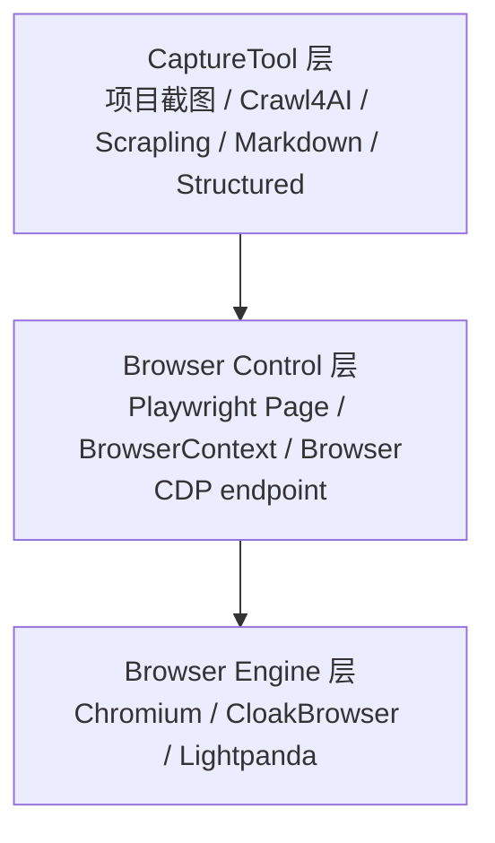
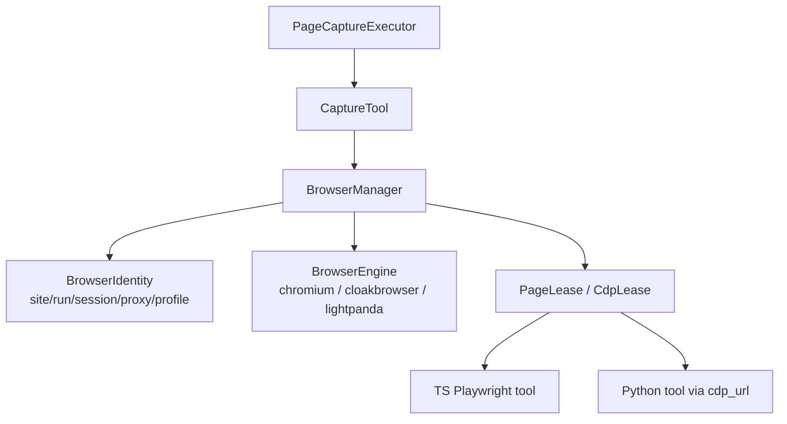

# Playwright 与浏览器分层设计

本文记录浏览器相关采集能力的分层设计。重点回答两个问题：

1. Playwright/CDP 是否适合作为多个浏览器实现与多个采集工具之间的桥接层。
2. 项目内部应该把哪些概念抽象成自己的领域边界，而不是散落在各个 tool 中。

## 1. 结论摘要

| 问题 | 结论 |
|------|------|
| Playwright 是否适合作为核心桥接层 | 适合，但它应该是浏览器控制协议层，不是项目的业务资源模型 |
| CDP 是否应该作为统一连接方式 | 适合用于跨语言和远程浏览器连接，但要接受比 Playwright 原生协议更低的能力保真度 |
| Crawlee / Crawl4AI / Scrapling 是否应该直接管理浏览器 | 不建议让任一上层工具拥有全局浏览器生命周期 |
| 项目需要新增什么抽象 | 需要项目自己的 BrowserManager / BrowserRuntime 层，统一管理 browser、context、profile、CDP endpoint、page lease |

一句话：**Playwright/CDP 是控制协议，BrowserManager 才应该是本项目的浏览器资源与身份边界。**

## 2. 当前项目状态

当前浏览器相关代码主要集中在：

| 文件 | 作用 |
|------|------|
| `src/capture/browser-provider.ts` | 定义 `BrowserProvider`，默认每次 `chromium.launch()` 并创建一个 page |
| `src/capture/captools/playwright-screenshot-tool.ts` | 通过 `BrowserProvider` 获取 page，导航后截图 |
| `src/capture/captools/python-tools.ts` | 调用 Python tool，间接使用 Crawl4AI / Scrapling |
| `src/crawlee/capture-runtime.ts` | 使用 Crawlee `BasicCrawler` 调度任务，并传入 `RuntimeContext` |

当前实现的特点：

- Crawlee 主要承担 run 内队列调度、并发、重试、session/proxy 信息承载。
- Playwright 只被本项目截图 tool 直接使用。
- Crawl4AI / Scrapling 作为 Python tool 独立执行，浏览器生命周期不由项目统一管理。
- Lightpanda 目前是 markdown CLI fallback，不是项目统一浏览器选项。
- `RuntimeContext.session` 和 `RuntimeContext.proxyInfo` 已经传到 capture 层，但默认 `PlaywrightBrowserProvider` 没有使用它们。

## 3. 三层模型

浏览器采集可以拆成三层：



### 3.1 CaptureTool 层

这一层回答“要从页面拿什么结果”：

- base：HTML、title、meta、body text、links
- markdown：正文 markdown
- screenshot：页面截图
- structured：结构化数据

本层应该关心 capability、结果验证、fallback、artifact 写入，而不是关心底层到底是 Chromium、CloakBrowser 还是 Lightpanda。

### 3.2 Browser Control 层

这一层回答“如何控制浏览器”：

- Playwright 原生连接
- Playwright `connectOverCDP`
- CDP endpoint 暴露给 Python tool
- page/context/browser 的创建、释放、崩溃处理

Playwright 适合放在这一层。它可以直接控制 Chromium，也可以通过 CDP 连接 Lightpanda 或其他 Chromium-compatible browser。

需要注意：Playwright 官方说明 `connectOverCDP` 只支持 Chromium 系浏览器，并且 CDP 连接比 Playwright 协议连接能力保真度更低。复杂能力如果依赖 Playwright 私有协议，CDP 路径可能会出现差异。

参考：

- Playwright `connectOverCDP`：https://playwright.dev/docs/api/class-browsertype#browser-type-connect-over-cdp

### 3.3 Browser Engine 层

这一层回答“实际跑的浏览器是什么”：

| Engine | 控制方式 | 适合场景 |
|--------|----------|----------|
| Chromium | Playwright 原生 / CDP | 默认路径，兼容性最好 |
| CloakBrowser | Playwright/Puppeteer API，patched Chromium，也可暴露 CDP | 强反爬、指纹一致性、需要接近真实 Chromium 行为 |
| Lightpanda | CDP server / CLI / TS API | 低资源、高吞吐、轻量 JS 页面、机器采集 |

CloakBrowser README 描述它是自定义 Chromium binary 的薄 wrapper，返回标准 Playwright/Puppeteer browser 对象。Lightpanda 文档说明它可以启动 CDP server，并被 Playwright/Puppeteer 连接。

参考：

- CloakBrowser： https://github.com/CloakHQ/CloakBrowser
- Lightpanda CDP 使用： https://lightpanda.io/docs/getting-started/usage

## 4. Playwright 作为桥的边界

Playwright 作为桥是合理的，原因是：

- 本项目 TS tool 可以直接使用 `Page`、`BrowserContext`、`Browser`。
- Python tool 可以通过 CDP endpoint 连接同一个底层浏览器。
- Lightpanda、CloakBrowser、远程浏览器服务都可以通过 Playwright 或 CDP 接入。
- Playwright 类型和 API 足够稳定，便于现有截图 tool 与未来交互型 tool 复用。

但 Playwright 不应该成为业务层唯一抽象，原因是：

- Playwright 不知道本项目的 `siteId`、`runId`、`PageCaptureTask`、`CaptureProfile`。
- Playwright 不负责决定一个 context 应该绑定哪个 proxy/session/profile。
- Playwright 不负责跨 TS/Python tool 的 CDP endpoint 生命周期协调。
- Playwright 不负责持久业务状态，项目的真相源仍是 SQLite 和 artifact 文件。

因此项目内部需要一层比 Playwright 更靠近业务的抽象。

## 5. 推荐目标架构

推荐新增 BrowserManager / BrowserRuntime 层：



核心接口可以朝这个方向演进：

```ts
interface BrowserIdentity {
  siteId: number;
  runId: number;
  sessionId?: string;
  proxyKey?: string;
  engine: 'chromium' | 'cloakbrowser' | 'lightpanda';
  profileMode: 'ephemeral' | 'persistent';
}

interface BrowserManager {
  acquirePage(input: {
    identity: BrowserIdentity;
    url: string;
    runtime: RuntimeContext;
  }): Promise<PageLease>;

  acquireCdpEndpoint(input: {
    identity: BrowserIdentity;
    runtime: RuntimeContext;
  }): Promise<CdpLease>;

  retireIdentity(identity: BrowserIdentity, reason: string): Promise<void>;
  close(): Promise<void>;
}
```

其中：

- `PageLease` 面向 TS Playwright tool。
- `CdpLease` 面向 Crawl4AI、Scrapling、Lightpanda TS/CDP 客户端。
- `BrowserIdentity` 用于把站点、运行、代理、session、profile 绑定成一个自洽浏览器身份。
- `retireIdentity` 用于某个身份被封禁、崩溃、污染后主动淘汰。

## 6. 上层工具定位

| 工具 | 推荐定位 | 浏览器由谁管理 |
|------|----------|----------------|
| 本项目 Playwright screenshot tool | 原生 TS consumer | BrowserManager 返回 `PageLease` |
| Crawl4AI | Python consumer | BrowserManager 提供 `cdp_url`，Crawl4AI 使用 `BrowserConfig.cdp_url` |
| Scrapling | Python consumer | 优先通过 CDP 连接项目管理的浏览器 |
| Lightpanda markdown | 先保留 CLI fallback，后续升级为 engine 或 CDP browser option | BrowserManager 管理 Lightpanda process/CDP endpoint |
| CloakBrowser | BrowserEngine | BrowserManager 用 CloakBrowser launch 或 CDP server 创建身份 |
| Chromium | BrowserEngine | BrowserManager 用 Playwright 原生 launch 或 CDP 连接 |

Crawl4AI 已支持 `BrowserConfig.cdp_url`、proxy、persistent context、`user_data_dir` 等浏览器配置。因此它适合从“自己管理浏览器”逐步转为“连接项目提供的 browser identity”。

参考：

- Crawl4AI BrowserConfig： https://docs.crawl4ai.com/core/browser-crawler-config/

## 7. 不推荐的形态

### 7.1 每个 tool 自己启动浏览器

问题：

- 同一页面的 base、markdown、screenshot 可能来自不同 IP、cookie、UA、timezone、fingerprint。
- 资源不可控，每个 tool 都可能启动自己的 heavy browser。
- 无法统一 profile、proxy、session、重试和封禁淘汰策略。
- Python tool 和 TS tool 无法共享同一底层浏览器身份。

### 7.2 把 Crawlee BrowserPool 当全局浏览器模型

问题：

- 当前项目已经把 Crawlee 定位为调度器，不再让它直接访问所有页面。
- Crawl4AI / Scrapling 是 Python tool，更自然的共享边界是 CDP endpoint，不是 Node 内部 BrowserPool。
- Lightpanda / CloakBrowser / 远程浏览器服务不一定能自然纳入 Crawlee 的 browser pool 模型。
- 容易把项目浏览器身份策略再次耦合进 Crawlee。

### 7.3 把 Playwright 类型泄漏到所有业务层

问题：

- Planner、rules、repository、web read model 不需要知道 Playwright。
- 一旦未来接入 Lightpanda CLI、远程浏览器 API、非 Playwright consumer，替换成本会升高。
- Playwright 是控制层，不应该承载业务状态。
