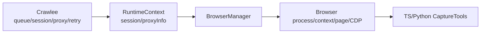

# 浏览器复用概念与策略

本文记录浏览器相关实体的概念、复用收益、风险和推荐策略。重点覆盖 browser process、BrowserContext、page/tab、persistent profile、cookie/storageState、CDP endpoint、Crawlee session/proxy 之间的关系。

## 1. 结论摘要

| 问题 | 建议 |
|------|------|
| 最先复用什么 | 先复用 browser process，再按身份复用 context/profile |
| 是否复用 page/tab | 初期不建议复用 page；用 page lease 短租短还 |
| 是否使用 persistent profile | 对登录态、强反爬、长期站点采集有价值，但必须按身份隔离 |
| 是否使用 Crawlee session/proxy | 可以作为策略输入，但不建议让 Crawlee 拥有浏览器生命周期 |
| 是否需要自己抽象 | 需要。复用策略应落在项目 BrowserManager，而不是散落到 tool 内部 |

一句话：**复用不是单纯为了省资源，而是为了让浏览器身份在性能、隔离、反爬自洽之间可控。**

## 2. 为什么要考虑复用

浏览器采集里的复用同时影响两类目标：

1. 性能与效率
   - 减少浏览器冷启动。
   - 降低内存和 CPU 抖动。
   - 避免每个 tool 重复创建浏览器。
   - 让并发能力可预测。

2. 身份连续性与反爬自洽
   - cookie、localStorage、cache、service worker 等状态是否连续。
   - proxy IP、timezone、locale、UA、viewport、fingerprint 是否匹配。
   - 同一业务页面的 base、markdown、screenshot 是否来自同一浏览器身份。
   - 被封禁或污染的身份是否可以被淘汰。

所以复用不是简单的“性能优化”。它同时决定系统对目标站点呈现出来的行为形态。

## 3. 核心概念

### 3.1 Browser process

Browser process 是实际浏览器进程，例如 Chromium、CloakBrowser、Lightpanda server。

特点：

- 启动成本最高。
- 占用内存最多。
- 可以承载多个 context 或多个 CDP client。
- 崩溃会影响其下所有 context/page。

当前项目的 `PlaywrightBrowserManager` 会按 `browser.reuse` 复用 browser process。默认 `run_browser` 表示一次 run 内按 engine 复用 browser process，并在 run 结束时关闭。

### 3.2 BrowserContext

BrowserContext 是 Playwright 中的隔离用户空间。一个 browser process 中可以创建多个 context。

它通常包含：

- cookie
- localStorage/sessionStorage
- viewport
- user agent
- locale/timezone
- permissions
- proxy 配置
- init script

可以把它理解成“一个临时浏览器用户身份”。大多数浏览器身份策略应该落在 context 层。

### 3.3 Persistent context / userDataDir

Persistent context 是带真实用户数据目录的 context。`userDataDir` 会保存浏览器状态。

它通常保存：

- cookie
- localStorage
- cache
- IndexedDB
- service worker
- 登录态
- 部分浏览器配置和站点状态

它适合长期身份，但也最容易出现状态污染和封禁延续。

### 3.4 Page / tab

Page 是浏览器 tab。

特点：

- 创建成本低于 browser/context。
- 页面脚本、弹窗、下载、导航状态、事件监听都聚集在 page 上。
- 复用 page 容易带来残留状态。

因此 page 适合短租短还：采集一个任务，关闭一个 page。

### 3.5 Cookie / storageState

Playwright `storageState` 是 cookie 和 localStorage 的可序列化快照。

它比 persistent profile 更轻：

- 容易保存、迁移、审计。
- 适合登录态恢复。
- 不包含完整浏览器 cache 和所有 profile 状态。

适合“需要身份连续，但不想持久化整个浏览器目录”的场景。

### 3.6 CDP endpoint

CDP endpoint 是 Chrome DevTools Protocol 的连接入口，例如：

```text
http://127.0.0.1:9222
ws://127.0.0.1:9222/devtools/browser/...
```

它的价值：

- TS 侧 Playwright 可以 `connectOverCDP`。
- Python 侧 Crawl4AI / Scrapling 可以连接同一底层浏览器。
- Lightpanda、CloakBrowser server、远程浏览器服务可以统一暴露浏览器能力。

风险：

- 多个 consumer 同时连接时，需要 lease 和并发控制。
- CDP 能力和 Playwright 原生协议不完全等价。
- endpoint 泄漏等同于暴露浏览器控制权。

### 3.7 Crawlee session

Crawlee session 是 Crawlee 的请求身份和健康状态单元。

它通常用于：

- 记录失败次数。
- 被封禁时 retire。
- 与 proxy 策略配合。
- 在请求之间携带 cookie jar 或 session 状态。

在当前项目里，Crawlee session **已经启用**。`src/crawlee/capture-runtime.ts` 创建的是 `BasicCrawler`，当前安装的 Crawlee 3.13.x 中 `BasicCrawler` 默认 `useSessionPool = true`；

因此运行时会打开 Crawlee `SessionPool`，每个 Crawlee request handler 会拿到一个 `context.session`。项目随后把它透传到 `RuntimeContext`。

也就是说，当前项目不是“未来可能启用 session”，而是“Crawlee 调度层已经有 session，浏览器层也会把它作为 browser identity、cookie 同步和健康检查的输入”。

Crawlee `Session` 本身可以保存和维护这些信息：

| 信息 | Crawlee Session 中的位置 / 能力 | 说明 |
|------|---------------------------------|------|
| session id | `session.id` | 可作为 browser identity 的一部分，也可用于代理 session/fingerprint seed |
| cookie | `session.cookieJar`、`getCookies(url)`、`setCookies(...)`、`getCookieString(url)` | Crawlee HTTP `sendRequest` 会使用它维护 cookie |
| 健康状态 | `errorScore`、`usageCount`、`isUsable()` | 判断 session 是否还适合继续使用 |
| 成功/失败反馈 | `markGood()`、`markBad()`、`retire()` | Crawlee 会在 request 成功/失败时自动更新，也可由业务显式 retire |
| 自定义信息 | `session.userData` | 可以挂少量 metadata，例如 fingerprint key、profile key、账号标识 |

当前 `RuntimeContext.sendRequest` 是基于 Crawlee `context.sendRequest` 包装的。Crawlee 的 `sendRequest` 会把当前 session 的 cookie jar 接进 HTTP 请求，并使用当前 crawling context 的 proxy URL。因此 `HttpBaseTool`、部分 markdown tool、Kickstarter adapter 这类使用 `runtime.sendRequest` 的工具，已经间接受 Crawlee session cookie 影响。

当前 `PlaywrightBrowserManager` 已经读取 `runtime.session`：

- 创建 context 时会尝试把 Crawlee session cookie 注入 BrowserContext。
- page release 时会把浏览器 cookie 回写 Crawlee session。
- 默认 `contextReuse: site_session_proxy` 会把 `session.id` 作为 context key 的一部分。
- `acquirePage` 前会检查 `session.isUsable()`，不可用时直接抛错。
- 不会根据浏览器侧 403/captcha 等结果主动 retire Crawlee session。

所以当前状态是：**HTTP 层和浏览器层已经共享 Crawlee session 信号，但封禁识别后的主动 retire 策略尚未落地。**

在新方案里，Crawlee session 的定位应该是“身份与健康信号输入”，而不是完整浏览器状态的唯一真相源：

```text
Crawlee Session
  -> 提供 session id / cookie / health / retire signal
  -> BrowserManager 用它选择 BrowserIdentity
  -> BrowserContext 可以导入/导出部分 cookie
```

建议读取 Crawlee session：

- 读取 `session.id`，作为 `BrowserIdentity.sessionId`。
- 读取 `session.getCookies(url)`，在创建 BrowserContext 或 page 前注入 cookie。
- 读取 `session.userData`，获取 profile key、account key、fingerprint key 等轻量 metadata。
- 读取 `session.isUsable()`、`errorScore`、`usageCount`，避免给坏 session 创建新 browser identity。

建议谨慎写回 Crawlee session：

- 浏览器导航后可以按站点策略把 page/context 中的新 cookie 回写到 `session.setCookies(...)`。
- 浏览器侧明确遇到 403/429/captcha/access denied 时，可以调用 `session.markBad()` 或 `session.retire()`。
- 浏览器侧成功完成可信采集时，通常不需要手动 `markGood()`，因为 Crawlee request 成功结束后会自动做一次成功反馈；除非后续把一个 Crawlee request 拆成多个 browser 子任务，才需要单独建模。

不建议把 Crawlee session 当作唯一持久 profile：

- Crawlee session 生命周期偏 request/session pool，不等同于长期浏览器用户目录。
- 它的 cookie jar 不是完整 browser profile，不包含 cache、IndexedDB、service worker、localStorage 的完整历史。
- Python tool、CDP endpoint、persistent profile 的生命周期不应该绑定死在 Crawlee 内部对象上。

推荐边界：

| 方向 | 是否建议 | 说明 |
|------|----------|------|
| Crawlee session -> BrowserManager | 建议 | 读取 id、cookie、健康状态，构造 BrowserIdentity |
| BrowserManager -> Crawlee session cookie | 可选、按策略 | 只同步目标站点必要 cookie，避免把浏览器噪声全部写回 |
| BrowserManager -> Crawlee session retire | 建议 | 浏览器明确发现封禁时通知 Crawlee 淘汰身份 |
| BrowserManager 把完整 profile 写入 Crawlee session | 不建议 | 完整 profile 应由 profile registry / storageState 管理 |
| 在 `session.userData` 存大对象 | 不建议 | 只存 key，不存大体积 profile/cookie dump |

### 3.8 Proxy

Proxy 决定网络出口 IP、地区、ASN、信誉。

它需要和浏览器身份保持自洽：

- proxy 地区与 timezone/locale 最好匹配。
- 同一个 cookie/profile 不应频繁跨无关 proxy 使用。
- HTTP base 和 browser screenshot 最好使用同一代理身份，否则页面可能不一致。

当前 `RuntimeContext.proxyInfo` 已经存在，但默认截图浏览器没有使用它。

### 3.9 Browser identity

Browser identity 是项目应该拥有的核心概念。它不是 Playwright 原生概念，而是业务层组合。

建议包含：

```ts
interface BrowserIdentity {
  siteId: number;
  runId: number;
  sessionId?: string;
  proxyKey?: string;
  engine: 'chromium' | 'cloakbrowser' | 'lightpanda';
  profileMode: 'ephemeral' | 'persistent' | 'storage_state';
}
```

它回答：

- 这个浏览器看起来像哪个用户。
- 它从哪个 IP 出去。
- 它是否保留历史状态。
- 它属于哪个站点、哪次 run、哪个 Crawlee session。
- 出问题时应该淘汰哪一组资源。

## 4. 到底复用什么

| 实体 | 是否复用 | 生命周期建议 | 主要收益 | 主要风险 | 适合场景 | 不适合场景 | 管理边界 |
|------|----------|--------------|----------|----------|----------|------------|----------|
| Browser process | 应该复用 | run 级或进程级；按 engine 分池 | 减少冷启动、降低内存抖动、统一 CDP endpoint | 崩溃影响多个任务；长时间运行可能泄漏资源 | Chromium/CloakBrowser 常规采集；Lightpanda server | 极低频、一次性任务 | BrowserManager |
| BrowserContext | 按身份复用 | site/session/proxy 级；任务结束可保留或关闭 | 身份连续、cookie 自洽、比 browser 更轻 | 状态污染；多个页面共享 context 可能互相影响 | 同站点多页面、同代理同身份 | 跨站点、跨账号、跨代理混用 | BrowserManager |
| Persistent profile / userDataDir | 谨慎复用 | site/account/proxy 长期级；需要可淘汰 | 登录态、长期可信身份、风控 cookie 连续 | 被标记后持续污染；磁盘膨胀；隐私风险 | 登录采集、强反爬、需要人工预热 | 临时匿名采集、测试可复现优先 | BrowserManager + profile registry |
| storageState | 推荐作为轻量身份材料 | 站点或账号级；可导入导出 | 轻量、可审计、便于恢复登录态 | 不含完整 cache/profile；跨 proxy 使用会可疑 | 登录态恢复、CI/调试、短期复用 | 需要完整浏览器历史的站点 | BrowserManager / auth module |
| Page / tab | 初期不复用 | 单任务 lease；用完关闭 | 隔离副作用、实现简单 | 每页仍有创建成本；过多 page 占内存 | 截图、单页提取、Crawl4AI 单次 run | 需要连续交互流程的多步任务 | PageLease |
| CDP endpoint | 按 engine/identity 复用 | 与 browser process 或 persistent profile 绑定 | TS/Python 工具共享底层浏览器；远程化容易 | 并发控制复杂；endpoint 泄漏风险；CDP 保真度差异 | Crawl4AI/Scrapling 连接项目浏览器；Lightpanda | 每个 tool 都独立控制同一 page | BrowserManager |
| Proxy binding | 应该按身份复用 | session/profile 级 | IP、cookie、timezone 自洽 | 代理失效会拖累身份；代理切换污染 profile | 强反爬、地区敏感页面 | 无代理或简单公开站点 | Crawlee strategy + BrowserManager |
| Crawlee session | 可作为复用 key | request/session pool 生命周期 | 与重试、封禁、proxy 选择联动 | Node/Crawlee 概念不应泄漏到所有 tool | 调度和封禁信号 | 直接管理 browser 生命周期 | Crawlee runtime input |
| HTTP cache | 谨慎复用 | context/profile 级 | 加速同站点资源加载、真实用户感 | 内容过期；跨任务污染 | 同站点多页截图、资源重页面 | 需要每次完整 fresh 页面 | BrowserContext/profile |
| Service worker / IndexedDB | 谨慎复用 | persistent profile 级 | 更接近真实浏览器状态 | 难清理、难复现、可能污染结果 | SPA、登录站点 | 测试确定性要求高 | Persistent profile |

## 5. 推荐默认策略

### 5.1 初始默认

适合作为第一版 BrowserManager 的默认策略：

```text
run 内复用 browser process
site/session/proxy 级创建 context
每个 capture task 创建 page lease
page 用完关闭
run 结束关闭 ephemeral context
```

这个策略的优点：

- 大幅减少每页 `launch()` 成本。
- 不复用 page，避免最常见的残留状态问题。
- context 可以绑定 proxy/session/storageState。
- 可以逐步支持 TS tool 和 Python tool 共享 CDP endpoint。

### 5.2 简单公开站点

```text
engine = chromium 或 lightpanda
profileMode = ephemeral
reuse = run_browser
context = site/run 级
page = task 级短租
```

目标是吞吐和稳定，不追求长期身份。

### 5.3 强反爬站点

```text
engine = cloakbrowser 或真实 Chromium
profileMode = persistent
reuse = site_session_proxy
context/profile 绑定 proxy、timezone、locale、UA、fingerprint
page = task 级短租
```

目标是身份自洽。不要让同一个 profile 在多个无关 proxy 之间漂移。

### 5.4 登录态站点

```text
profileMode = persistent 或 storageState
identity = site + account + proxy
context 复用登录态
封禁或登录失效时 retire identity
```

如果登录态重要，profile/account/proxy 的绑定关系应该显式记录，不能隐含在临时文件路径里。

### 5.5 轻量机器浏览器

```text
engine = lightpanda
profileMode = ephemeral
reuse = process/server
CDP endpoint 复用
```

适合大量公开页面、低资源 markdown/HTML 提取。对于强浏览器指纹检测站点，应允许 fallback 到 Chromium/CloakBrowser。

## 6. Crawlee 的角色

建议 Crawlee 继续负责：

- request queue
- maxConcurrency
- retry/backoff
- requestHandler timeout
- session pool
- proxy 信息和封禁信号
- HTTP `sendRequest` 的 cookie jar 与 session 健康反馈

不建议 Crawlee 负责：

- Browser process pool
- persistent profile registry
- CDP endpoint 生命周期
- TS/Python tool 之间的浏览器共享
- browser identity 的业务建模

推荐关系：



Crawlee session/proxy 是输入信号，BrowserManager 根据这些信号选择或创建 browser identity。

更具体地说，新方案里可以把 Crawlee session 当作 browser identity 的一个组成部分：

```text
BrowserIdentity.sessionId = runtime.session.id
BrowserIdentity.proxyKey = runtime.proxyInfo.url 或代理 session key
BrowserIdentity.profileKey = runtime.session.userData.profileKey
```

但 BrowserManager 不应该把自己的完整状态塞回 Crawlee session。推荐只做三类轻量交互：

1. **读身份**：读取 `session.id`、`userData`、cookie、健康状态。
2. **同步 cookie**：在需要 HTTP/browser 身份一致时，把必要 cookie 在 Crawlee session 与 BrowserContext 之间同步。
3. **反馈封禁**：浏览器发现明确封禁时调用 `session.markBad()` 或 `session.retire()`。

这样 Crawlee 仍然是调度器和 session/proxy 策略来源；BrowserManager 则拥有 browser process、context、profile、CDP endpoint 的真实生命周期。

## 7. 复用 key 设计

不同场景可以使用不同复用 key：

| 复用级别 | Key 示例 | 含义 |
|----------|----------|------|
| run browser | `engine + runId` | 一次 run 共享一个或少量 browser process |
| site browser | `engine + siteId` | 同站点长期复用 browser process |
| session context | `siteId + sessionId + proxyKey` | 一个 Crawlee session 对应一个 context |
| account profile | `siteId + accountId + proxyKey` | 登录账号绑定 profile |
| lightpanda server | `engine + runId` 或全局 | 轻量 CDP server 复用 |

初期建议：

```text
processKey = engine + runId
contextKey = siteId + sessionId + proxyKey + profileMode
pageKey = 不复用
```

后续如果需要长期登录态，再引入：

```text
profileKey = siteId + accountId + proxyKey + engine
```

## 8. 封禁与淘汰

复用必须配套淘汰机制，否则被污染的身份会持续产生坏结果。

常见淘汰信号：

- 导航超时频繁发生。
- 页面标题或正文命中 captcha / access denied / blocked。
- screenshot 明显是风控页。
- HTTP 状态为 403/429。
- Crawl4AI/Scrapling 返回反爬诊断。
- 登录态失效。
- browser process 崩溃或 CDP 断连。

淘汰动作：

| 级别 | 动作 |
|------|------|
| page | 关闭当前 page |
| context | 关闭 context，清理临时状态 |
| persistent profile | 标记为 suspect / blocked，停止复用 |
| proxy | 通知 Crawlee/session/proxy 策略 retire |
| browser process | 关闭并重建 |

未来如果要把封禁淘汰做成显式策略，BrowserManager 可以暴露类似接口：

```ts
retireIdentity(identity, reason)
```

这样 tool 不需要知道底层要关闭 page、context、profile 还是 proxy。

## 9. 并发控制

浏览器复用后，并发控制需要从“Crawlee request 并发”扩展到“浏览器资源并发”：

| 资源 | 建议限制 |
|------|----------|
| browser process | 每个 engine/run 限制数量 |
| context | 每个 site/session/proxy 限制数量 |
| page | 每个 context 限制并发 page 数 |
| CDP clients | 每个 endpoint 限制连接者 |
| persistent profile | 同一 profile 通常只允许一个 active context |

示例：

```text
run maxConcurrency = 5
browser process per run = 1-2
contexts per browser = 5-20
pages per context = 1-3
persistent profile active context = 1
```

不要只依赖 Crawlee `maxConcurrency`。它限制 request handler 数量，但不知道每个 handler 内部会开几个 browser、几个 page、几个 CDP client。

## 10. 配置建议

浏览器策略已经放到 `SiteConfig.browser`：

```json
{
  "browser": {
    "engine": "chromium",
    "profileMode": "ephemeral",
    "reuse": "run_browser",
    "contextReuse": "site_session_proxy",
    "pageReuse": "none",
    "proxyBinding": "session"
  }
}
```

字段含义：

| 字段 | 含义 |
|------|------|
| `engine` | `chromium` / `cloakbrowser` / `lightpanda` |
| `profileMode` | `ephemeral` / `persistent` / `storage_state` |
| `reuse` | browser process 复用级别 |
| `contextReuse` | context 复用级别 |
| `pageReuse` | 是否复用 page，初期建议 `none` |
| `proxyBinding` | proxy 与 session/profile 的绑定方式 |

capture profile 仍负责 tool 顺序：

```json
{
  "captureProfile": {
    "tools": ["http-base", "defuddle-markdown", "lightpanda-markdown", "jina-markdown", "playwright-screenshot"]
  }
}
```

也就是说：

- `captureProfile` 决定“用什么工具抓”。
- `browser` 决定“这些工具使用什么浏览器身份”。

## 11. 已落地与后续方向

### 已落地

- 保留 page 短租短还。
- 一个 run 内按 engine 复用 browser process，支持 `run_browser` / `site_browser` key。
- context 默认按 site + session + proxy + profile 复用，也支持 `site_run`。
- 截图 tool、Lightpanda markdown、Crawl4AI / Scrapling bridge 使用 BrowserManager。
- BrowserManager 暴露 `acquirePage(...)` 和 `acquireCdpEndpoint(...)`。

### 后续方向：persistent profile / storageState

- 增加 profile registry。
- profile 与 site/account/proxy 绑定。
- 支持人工预热、登录态导入、封禁淘汰。

适合强反爬和登录态站点。

## 12. 修改导航

| 目标 | 优先查看 |
|------|----------|
| 当前 BrowserManager | `src/capture/browser-provider.ts` |
| 当前截图 tool | `src/capture/captools/playwright-screenshot-tool.ts` |
| RuntimeContext session/proxy 来源 | `src/crawlee/capture-runtime.ts` |
| Python bridge | `src/capture/python-bridge.ts`、`src/capture/captools/crawl4ai-tool.ts`、`src/capture/captools/scrapling-tool.ts` |
| Capture profile | `src/capture/profile-resolver.ts`、`src/domain/types.ts` |
| 站点配置解析 | `src/config/site-config.ts` |
