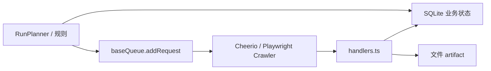

# Crawlee 耦合分析

本文说明本项目与 [Crawlee](https://github.com/apify/crawlee) 的耦合程度：哪些能力绑定在 Crawlee 上、业务层如何与之隔离、以及若要替换执行框架需要动哪些代码。

## 1. 结论摘要

| 维度 | 程度 | 说明 |
|------|------|------|
| 执行路径 | **高** | 无 Crawlee 则无队列调度、HTTP 抓取（Cheerio/got-scraping）、浏览器截图（Playwright）、内置重试与并发 |
| 业务模型 | **低** | 领域类型在 `src/domain/types.ts`；`request.userData` 仅为载荷，不依赖 Crawlee 类型泄漏到 planner/db/web |
| 数据与查询 | **很低** | Web、导出、库存查询只读 SQLite，不读 Crawlee storage |
| 可替换性 | **中等** | 主要重写 `src/crawlee/` 与 `services.ts` 中的 run 编排；约九成业务代码可保留 |

**一句话**：Crawlee 被当作**单次 run 内的临时调度器 + HTTP/浏览器执行引擎**；SQLite、Planner、规则、导出、Web 等模块**不直接 import `crawlee`**。`src/app/services.ts` 是编排入口，不把核心业务逻辑写进 Crawlee API。

## 2. 职责分工



| 职责 | 负责方 |
|------|--------|
| 是否抓取、update policy、URL 规则、站点配置 | SQLite + `RunPlanner` + `rules/` |
| 队列、并发、重试、HTTP/浏览器请求 | Crawlee |
| 页面解析、分类、写 artifact、链式入队 markdown/screenshot | `src/crawlee/handlers.ts` + adapters |
| UI、导出、库存聚合 | 只读 SQLite / 文件系统 |

设计上**不在应用层再实现一套与 Crawlee 竞争的运行队列**；也**不把业务查询建立在 Crawlee storage 内部结构**上。持久真相源是 SQLite 与 artifact 目录。

## 3. 直接依赖 Crawlee 的代码

全仓库中 **`import 'crawlee'`** 仅出现在以下位置：

| 文件 | 用途 |
|------|------|
| `src/crawlee/crawler-factory.ts` | 创建 `CheerioCrawler`、`PlaywrightCrawler`、`BasicCrawler` |
| `src/crawlee/handlers.ts` | `RequestQueue`、`CheerioCrawlingContext`、三阶段 request handler |
| `src/crawlee/queue-factory.ts` | 按 run 打开命名 `RequestQueue` |
| `src/app/services.ts` | `Configuration`；创建队列与 crawler 并调用 `run()` |
| `src/utils/runtime-logger.ts` | `LoggerJson` 桥接，将 Crawlee 日志写入当前 run 的 `runtime.log` |

**无 Crawlee 依赖的模块**（举例）：`planner/`（包含 `RunTargetTracker` 运行目标计数）、`db/`、`domain/`、`rules/`、`export/`、`web/`、`classification/`、`markdown/`、`screenshot/`、`config/`、`extract/`。

### 体量（约数）

- `src/crawlee/*.ts`：约 **936 行**（handlers + factory + queue）
- `src/app/services.ts`：约 **786 行**，其中与 Crawlee 强相关主要为 `executeRunWithRuntime`（约 250 行量级），其余为项目管理、通知、导出等
- 占 `src/` 下 TypeScript（不含 `frontend`）总量约 **10%** 量级

## 4. `services.ts` 与 Crawlee 的边界

`M1App` 的公开能力大量与 Crawlee 无关（站点/项目 CRUD、导出、库存、配置解析等）。与 Crawlee 的交汇集中在私有方法 `executeRunWithRuntime`：

1. 创建 `Configuration`（内存队列，不持久化 Crawlee storage）
2. `openRunQueue` 打开 base / markdown / screenshot 三条队列
3. 展开启动 URL（seed、sitemap、inventory），**在入队前**调用 `RunPlanner.planRequest`
4. 对允许抓取的候选调用 `baseQueue.addRequest`（带 `uniqueKey` 与 `userData`）
5. `createBaseCrawler` / `createMarkdownCrawler` / `createScreenshotCrawler`
6. 顺序执行：`baseCrawler.run()` →（`crawl_run` 时）markdown → screenshot
7. 刷新 SQLite 统计并结束 run

显式避免用 Crawlee storage 承载业务状态：

```ts
const configuration = new Configuration({
  // Crawlee queues are only transient schedulers for a single run. The durable
  // crawl state lives in SQLite and artifacts, so keeping queues in memory
  // avoids local request_queues lock-file races during long crawls.
  persistStorage: false,
  purgeOnStart: true,
});
```

见 `src/app/services.ts` 中 `executeRunWithRuntime`。

## 5. 执行层接缝：`src/crawlee/`

### 5.1 队列

`src/crawlee/queue-factory.ts` 为每次 run 按阶段创建命名队列，例如 `run-{runId}-base`。队列仅存于本次 run 生命周期内。

### 5.2 Crawler 工厂

`src/crawlee/crawler-factory.ts`：

| 阶段 | Crawler 类型 | 典型并发 |
|------|----------------|----------|
| base | `CheerioCrawler` | `maxConcurrency = 5` |
| markdown | `BasicCrawler`（调用 markdown adapter） | 见 factory |
| screenshot | `PlaywrightCrawler` 或 `BasicCrawler`（视 adapter） | 浏览器阶段更低 |

### 5.3 Handlers

`src/crawlee/handlers.ts` 是 Crawlee 侧**最重要的业务入口**，但依赖注入的是项目自己的 repository、planner、adapter，而不是把策略塞进 Crawlee 内部 hook：

- `createBaseRequestHandler` — HTTP 抓取、分类、发现链接、入队 markdown/screenshot
- markdown / screenshot 阶段 handler — 写 artifact、更新 `artifact_runs`
- `failedRequestHandler` — Crawlee 重试耗尽后的最终失败落库

Handler 签名仍绑定 Crawlee 类型（如 `CheerioCrawlingContext`、`RequestQueue`），属于**执行层 API 泄漏**，未上推到 domain/planner。

### 5.4 请求模型

同一业务页面在一次 run 中可能对应多条 Crawlee request（base / markdown / screenshot）。业务信息通过 `request.userData` 传递，类型定义在 `src/domain/types.ts`（`BaseRequestUserData` 等）。去重依赖 Crawlee 的 `uniqueKey`（例如 `base:${runId}:${sitePageId}`）。

## 6. 绑定在 Crawlee 上的运行时能力

若迁移到其他爬虫/队列框架，需要自行补齐的能力包括：

1. **RequestQueue 语义** — 入队、去重、`uniqueKey`、三阶段队列串联
2. **HTTP 抓取 + HTML 解析** — 当前为 `CheerioCrawler` + got-scraping
3. **浏览器抓取** — 截图阶段的 `PlaywrightCrawler`（或 fallback `BasicCrawler`）
4. **重试与并发** — `maxRequestRetries`、`maxConcurrency`、`failedRequestHandler`
5. **重定向与最终 URL** — 当前主要依赖 Crawlee 默认行为（如 `request.loadedUrl`），见重定向专题文档

**不必从 Crawlee 迁出的部分**：站点配置、更新策略、URL 规则、分类器、Markdown/截图 adapter、SQLite schema、导出、Web UI。

## 7. 与 Crawlee 弱耦合或无关的部分

- **Planner**（`src/planner/`）：入队前的 `planRequest`、update policy、sitemap 展开
- **Rules**（`src/rules/`）：二阶段入队决策
- **Repositories**（`src/db/`）：run、page、artifact 业务状态
- **Adapters**（`markdown/`、`screenshot/`）：通过接口注入 crawler factory，不 import Crawlee
- **Web**（`src/web/`）：读模型来自 SQLite；`RunCoordinator` 限制并发 run，与 Crawlee 无直接类型耦合
- **日志**：`runtime-logger.ts` 对 Crawlee 的依赖仅为全局 logger 桥接，可随执行框架一并替换

## 8. 修改时的导航

| 目标 | 优先查看 |
|------|----------|
| 改抓取/发现/入队流程 | `src/crawlee/handlers.ts` |
| 改并发、重试、HTTP/浏览器选项 | `src/crawlee/crawler-factory.ts` |
| 改 run 启动、队列生命周期、阶段顺序 | `src/app/services.ts` → `executeRunWithRuntime` |
| 改「要不要爬」 | `src/planner/`、`src/rules/`（Crawlee 之前） |
| 改查询/UI | `src/web/queries/`、repositories（无 Crawlee） |
| 评估替换 Crawlee | 本文第 6 节 + 重写 `src/crawlee/` 与 `services.ts` 编排 |

## 9. 设计意图（与历史文档一致）

M1 架构文档（`docs/old/m1-architecture.md` 等）中的原则在本代码中仍成立：

- Crawlee **as-is**，不 fork、不深改内部
- 通过 `RequestQueue`、crawler、`requestHandler` / `failedRequestHandler` 集成
- 业务策略在 planner / handlers 注入的依赖中决策，而非 Crawlee storage
- 新 run 使用 run-scoped 队列命名空间；resume 同一 run 时复用队列（见架构文档中的 run 生命周期说明）

当前实现将 **Crawlee storage 持久化关闭**（`persistStorage: false`），进一步把「执行调度」与「业务持久化」拆开，降低长时间运行时的本地锁文件问题，并强化「SQLite + 文件 = 真相源」这一模型。
