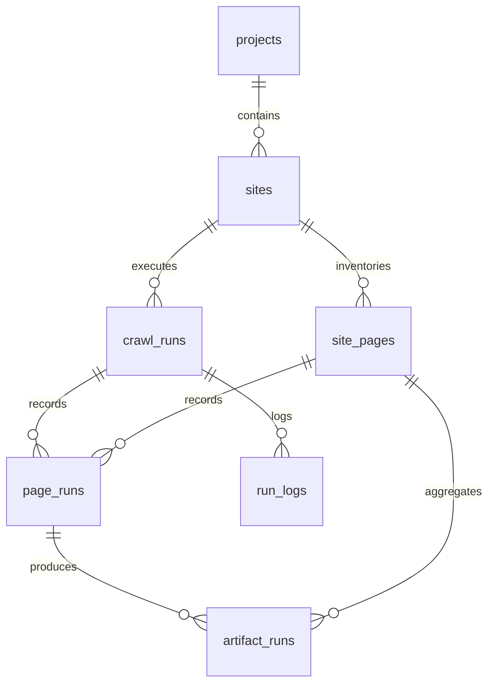

# 数据库结构与兼容迁移

本文说明业务数据库的结构、初始化顺序和手动 migration 规则。代码入口在 `src/db/database.ts`，repository 在 `src/db/repositories/`。

## 1. 数据库入口

`openDatabase(...)` 返回统一的 `DbClient`：

- 默认使用 SQLite，路径来自显式 `path`、`KVAULT_DB_PATH` 或 `.local/state.db`。
- 当显式传入 PostgreSQL URL，或没有显式 SQLite path 且 `KVAULT_DATABASE_URL` 是 `postgres://` / `postgresql://` 时，使用 PostgreSQL。
- SQLite client 使用 `node:sqlite` 的 `DatabaseSync`，并开启 `PRAGMA foreign_keys = ON`。
- PostgreSQL client 使用 `pg.Pool`，并把 `?` 参数转换成 `$1`、`$2` 形式。

业务代码不直接依赖具体数据库实现，应通过 `DbClient` 和 repository 访问数据库。

## 2. Schema 结构

当前主表：

- `projects`：项目。
- `sites`：站点配置和存储边界，属于一个 project。
- `crawl_runs`：一次 seed / crawl 运行批次。
- `site_pages`：站点级页面清单，一站点内按 `normalized_url` 去重。
- `page_runs`：一次运行中某页面的 base 抓取、分类和规则判定结果。
- `artifact_runs`：markdown / screenshot / structured 等 artifact 抓取结果。
- `run_logs`：运行期结构化日志。

关系概览：



几个容易混淆的表职责：

- `site_pages` 是页面清单和跨 run 聚合状态，保存最新 base / markdown / screenshot / structured 状态与时间。
- `page_runs` 是某次 run 的 base 结果快照，保存 title、正文、分类标签、规则结果和 required artifacts。
- `artifact_runs` 是单个 artifact 的运行记录，保存状态、输出路径、文本内容和 metadata。
- `crawl_runs` 的计数在 run 结束时由 repository 根据明细表回算，不是每次写明细时实时维护。

## 3. 初始化顺序

`initializeSchema(db)` 的顺序是固定的：

```text
baseTablesSchema -> migrations -> indexesSchema
```

含义：

- `baseTablesSchema` 只负责最终版本的表结构。新库会直接创建完整表；旧库已有表时，`CREATE TABLE IF NOT EXISTS` 不会修改表结构。
- `migrations` 负责把旧库补到当前结构，包括新增列和需要重建的索引。
- `indexesSchema` 负责创建最终版本的索引。大部分已有索引会因为 `IF NOT EXISTS` 跳过；被 migration drop 掉的索引会按新定义重建。

PostgreSQL 的表 schema 由 `baseTablesSchema` 转换得到，目前只把 `INTEGER PRIMARY KEY AUTOINCREMENT` 替换成 `SERIAL PRIMARY KEY`。索引 schema 目前同时适用于 SQLite 和 PostgreSQL。

## 4. Migration 写法

这里没有独立 migration 框架，migration 是 `src/db/database.ts` 里手动维护的幂等 SQL 数组。新增数据库结构时按下面规则处理。

### 4.1 新增列

同时改两处：

1. 在 `baseTablesSchema` 的对应 `CREATE TABLE` 中加入最终列定义，保证新库一次创建到最新结构。
2. 在 `migrations` 中加入对应 `ALTER TABLE ... ADD COLUMN ...`，保证旧库能补列。

PostgreSQL 执行前会把 `ADD COLUMN` 改成 `ADD COLUMN IF NOT EXISTS`。SQLite 没有用这个语法，当前通过捕获“列已存在”错误保持幂等。

### 4.2 修改索引结构

`CREATE INDEX IF NOT EXISTS` 不会更新同名旧索引。如果索引定义变了，必须在 `migrations` 中显式加入：

```sql
DROP INDEX IF EXISTS index_name
```

然后在 `indexesSchema` 中保留最终版本的 `CREATE INDEX IF NOT EXISTS ...`。

如果新索引引用了新增列，顺序必须是：

```text
ADD COLUMN -> DROP INDEX -> CREATE INDEX
```

例如 `idx_site_pages_site_latest_handled` 引入 `last_structured_at` 后，migration 先补 `last_structured_at`，再 drop 旧索引，最后由 `indexesSchema` 重建新索引。

### 4.3 新增表

在 `baseTablesSchema` 中加入 `CREATE TABLE IF NOT EXISTS`。如果新表需要索引，把索引放到 `indexesSchema`。

新增表通常不需要额外 migration，因为旧库执行 `CREATE TABLE IF NOT EXISTS` 时会创建缺失的新表。

### 4.4 修改表约束或重塑数据

SQLite 对修改已有表约束、删除列、改列类型支持有限。遇到这类变更时，不要堆叠绕过式 SQL；应该设计一次明确的数据迁移步骤，例如创建新表、复制数据、校验、替换旧表。

这类迁移应单独评估 SQLite 和 PostgreSQL 的差异，并增加针对性测试。

JSON 配置结构变更也在 `initializeSchema()` 中执行一次性数据迁移。例如站点抓取配置从 `captureProfiles` / `defaultCaptureProfile` 收敛为单个 `captureProfile` 时，迁移会同时更新：

- `sites.config_json`
- `crawl_runs.config_snapshot_json`

业务配置解析和执行代码只接受迁移后的新结构；旧结构读取只存在于迁移函数中，避免兼容逻辑进入正常运行路径。

## 5. 注意事项

- 不要只改 `CREATE TABLE`。旧库已有表时这部分基本不会生效。
- 不要指望 `CREATE INDEX IF NOT EXISTS` 更新索引定义。同名索引存在时它会直接跳过。
- migration 中的 SQL 要保持幂等，能在新库和旧库上重复执行。
- 新增 repository 字段时，要同步更新写路径、读模型、导出逻辑和相关测试。
- `src/scripts/migrate-sqlite-to-postgres.ts` 是 SQLite 到 PostgreSQL 的数据复制脚本，不是日常 schema migration 框架。
- 新增会影响初始化顺序的 migration 时，补充或更新 `tests/database.test.ts`，覆盖列迁移、索引重建和 PostgreSQL 兼容行为。

## 6. 常见变更检查表

新增字段：

- 改 `baseTablesSchema`。
- 加 `ALTER TABLE ... ADD COLUMN ...` migration。
- 更新对应 repository 类型、insert / update / select。
- 更新 Web read models、exporter 或业务查询。
- 补测试。

修改索引：

- 改 `indexesSchema` 里的最终定义。
- 在 `migrations` 中 `DROP INDEX IF EXISTS ...`。
- 如果索引引用新增列，确认 drop 在补列之后。
- 补初始化顺序测试。

新增 artifact 类型：

- 更新 domain 类型和 capture 写入路径。
- 更新 `site_pages` 聚合字段或确认复用现有字段。
- 更新 `artifact_runs` 写入、read model 和导出逻辑。
- 检查 update policy 是否需要识别新 artifact。
