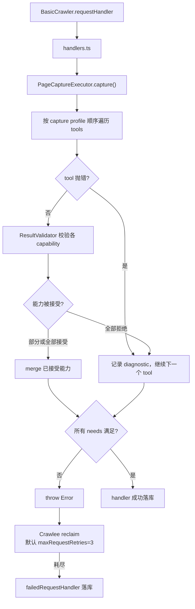

# 重试、工具链 Fallback 与 Validator

本文说明当前实现里两层「失败恢复」机制的分工：**PageCaptureExecutor 的工具链 fallback**（顺序降级，不是同一 tool 重试）与 **Crawlee BasicCrawler 的 request 级重试**（reclaim + session pool）。并说明 Session 何时滚动、以及 `ResultValidator` 如何参与决策。

相关文档：

- [Crawlee 耦合分析](./crawlee-coupling.md)
- [浏览器复用策略](./browser-reuse-strategy.md)
- [M2 技术设计](../m2-tech-design.md) 第 8–10 节（capture profile、validator、proxy 目标模型）

## 1. 结论摘要

| 问题 | 当前行为 |
|------|----------|
| 工具链内有重试吗？ | **没有**。每个 tool 在一次 handler 调用中最多执行一次；失败时按 capture profile **顺序尝试下一个 tool**（fallback） |
| 工具链失败后进 Crawlee 重试吗？ | **会**。所有 tool 跑完仍有未满足的 `needs` 时 executor 抛错，Crawlee 按 `maxRequestRetries` reclaim 整页重跑 |
| Session 何时滚动？ | 失败时 `markBad` 累积至 blocked 后换 session；`SessionError` 时 `retire` 轮换（HTTP 路径少见）；浏览器层不主动 retire Crawlee session |
| Validator 的角色？ | tool 返回后的质量门禁；拒绝 → fallback 下一 tool；全部失败 → 触发 Crawlee 重试 |

**一句话**：Executor 负责「换工具」，Crawlee 负责「整页再来一遍」；Validator 决定某个 tool 的产出是否算成功，但不直接触发 Crawlee 重试。

## 2. 整体流程



关键代码位置：

| 模块 | 文件 |
|------|------|
| Crawlee 运行时 | `src/crawlee/capture-runtime.ts` |
| 业务 handler | `src/crawlee/handlers.ts` |
| 工具链与 fallback | `src/capture/executor.ts` |
| 结果验收 | `src/capture/result-validator.ts` |
| Profile 解析 | `src/capture/profile-resolver.ts` |

## 3. Executor 工具链：Fallback，不是重试

### 3.1 执行模型

`PageCaptureExecutor.capture()` 在一次 Crawlee request handler 调用内：

1. 通过 `CaptureProfileResolver` 解析站点 `captureProfiles` 中的 tool 顺序。
2. 按顺序遍历 tool；若某 tool 不覆盖剩余 `needs`，跳过。
3. 调用 `tool.capture()`；成功返回后由 `ResultValidator` 逐 capability 验收。
4. 通过验收的能力 merge 进 `CaptureResult`；已满足的能力不再重复抓取。
5. 所有 tool 遍历结束后，若仍有 missing `needs`，抛出 `Error`。

核心循环见 `src/capture/executor.ts`：`for (const tool of resolvedProfile.tools)`，catch 分支记录 diagnostic 后继续，不中断整链。

### 3.2 三种失败形态

| 情况 | Executor 行为 | 是否继续下一 tool |
|------|---------------|-------------------|
| tool **抛错**（如 `HttpBaseTool` 遇到 status ≥ 400） | catch，记 `status: failed` diagnostic | 是 |
| tool **返回但 Validator 拒绝** | 不 merge 该 capability，记 `failed`（若无任何 capability 被接受） | 是 |
| tool **部分成功** | merge 已通过验收的能力，仅为剩余 needs 继续 | 是 |
| 所有 tool 跑完仍有 missing needs | `throw new Error('Capture failed...')` | 否（冒泡给 Crawlee） |

### 3.3 没有「同一 tool 重试」

- 每个 tool 在**单次 handler 调用**中最多执行**一次**。
- `src/capture/` 下除 diagnostic 文案外，没有 per-tool retry 逻辑。
- `HttpBaseTool` 对 4xx/5xx 直接抛错，不内部重试：

```ts
if (statusCode !== undefined && statusCode >= 400) {
  throw new Error(`HTTP base request failed with status ${statusCode}`);
}
```

部分 HTTP markdown tool（如 `defuddle-markdown`）收到错误状态码时可能不抛错，而是处理响应体；此时由 Validator 根据内容或（对 `base` capability）statusCode 拒绝。

### 3.4 与 capture profile 的关系

`CaptureProfileResolver` 按站点配置的 tool 名列表解析 tool 实例，并过滤掉不覆盖当前 `needs` 的 tool。Fallback 顺序完全由 profile 中的 `tools` 数组决定，默认链见 `DEFAULT_CAPTURE_TOOL_CHAIN`（`src/capture/profile-resolver.ts`）。

设计意图见 `docs/m2-tech-design.md` 第 8 节：规则决定「要不要抓、要哪些 artifact」；capture profile 决定「用哪些 tool、失败后按什么顺序降级」。

## 4. Crawlee Request 级重试

### 4.1 何时触发

当 `handlers.ts` 中 `await executor.capture(...)` 抛错（或 handler 其他步骤抛错）时，错误不被业务层 catch，由 Crawlee `BasicCrawler` 接管：

- 若 `request.retryCount < maxRequestRetries`，reclaim 请求回队列，`retryCount++`，稍后整页重跑。
- 每次 handler 失败，Crawlee 对当前 session 调用 `markBad()`。
- 重试时**整段工具链从头再跑**，不是从失败的 tool 续跑。
- 重试耗尽后调用 `failedRequestHandler`（`createPageCaptureFailedRequestHandler`），写入 `base_page_failed` 或 `artifact_failed`。

### 4.2 项目侧 Crawlee 配置

`src/crawlee/capture-runtime.ts` 显式配置：

```ts
const ANTI_BLOCKING_OPTIONS = {
  retryOnBlocked: true,
  sameDomainDelaySecs: 1,
} as const;
```

未覆盖的 Crawlee 默认值（3.16）：

| 选项 | 默认值 | 含义 |
|------|--------|------|
| `maxRequestRetries` | `3` | 最多 reclaim 3 次，即最多 **4 次**尝试（初次 + 3 次重试） |
| `maxSessionRotations` | `10` | session 轮换上限；**不计入** `maxRequestRetries` |
| `useSessionPool` | `true` | 启用 SessionPool |
| `requestHandlerTimeoutSecs` | `60` | 单次 handler 超时 |

### 4.3 与 manual test 06 的对应关系

`tests/manual-m2-crawl/configs/06-flaky-retry-proxy-session.json` 验收的是这一层：

- `flaky-500-then-200`：首次 500 → 工具链无法满足 needs → Crawlee reclaim → 第二次 200 成功。
- `always-blocked`：持续 403 → 重试到上限 → `failedRequestHandler` 落库。

不能只看最终 artifact 数量；需结合 `runtime.log` 中的 reclaim 与 failed handler 记录。

## 5. Session 何时滚动

### 5.1 Crawlee Session Pool

项目通过 `sessionPoolOptions: { maxPoolSize: 50 }` 启用 SessionPool。每个 request handler 从 `context.session` 拿到 session，并透传到 `RuntimeContext`（`src/crawlee/capture-runtime.ts`）。

每次 task 开始时 Crawlee 调用 `sessionPool.getSession()` 分配 session。

### 5.2 Session 状态变化

| 触发条件 | Crawlee 行为 | 在当前项目中的实际程度 |
|----------|--------------|------------------------|
| request 成功 | `session.markGood()` | 每次成功抓取 |
| requestHandler 失败 | `session.markBad()`，errorScore +1 | 每次工具链最终失败 |
| errorScore ≥ maxErrorScore（默认 3） | session blocked，`isUsable() === false` | 连续失败后换 session |
| 抛出 `SessionError` | `_rotateSession()` → `session.retire()` | BasicCrawler + 当前 HTTP 工具路径**基本不会**抛 `SessionError` |
| blocked status code（401/403/429） | `session.retire()` | Cheerio/Playwright 路径会自动检测；**BasicCrawler 的 `sendRequest` 不自动检测**，由工具自行处理状态码 |

每次 retry 会重新 `getSession()`，可能拿到不同 session（前一个已被 markBad/block）。

### 5.3 `retryOnBlocked: true` 的副作用

项目设置了 `retryOnBlocked: true`。在 Crawlee 3.16 中，若未同时传入 `sessionPoolOptions.blockedStatusCodes`，会将 `blockedStatusCodes` 置为 `[]`，从而**禁用** SessionPool 默认的 401/403/429 retire 逻辑。当前 HTTP 抓取路径主要依赖工具抛错 + handler 失败后的 `markBad`，而非 blocked status code 自动 retire。

### 5.4 浏览器层与 Crawlee Session

`PlaywrightBrowserManager`（`src/capture/browser-provider.ts`）：

- 读取 `session.id` 构造 `BrowserIdentity`（`contextReuse: site_session_proxy` 时按 session 分 context）。
- `acquirePage` 前检查 `session.isUsable()`，不可用则抛错。
- 支持 cookie 与 Crawlee session 双向同步。

**不会**在浏览器侧 403/captcha 时主动调用 `session.markBad()` / `session.retire()`。`retireIdentity()` 用于清理浏览器 context/process（尤其 Lightpanda 的 `lease:*` 短生命周期），不是 Crawlee session 轮换。

详见 [浏览器复用策略](./browser-reuse-strategy.md) 第 3.7 节。

## 6. ResultValidator 配合

### 6.1 调用时机

Validator 在 **tool 成功返回之后、merge 之前**，对每个相关 capability 调用 `validate()`（`src/capture/executor.ts`）。只有通过验收的 capability 才会 `mergeResult`。

站点级 `validation` 与 profile 级 `validation` 会 merge：profile 规则追加到全局规则（`src/capture/result-validator.ts` 的 `mergeRule`）。

### 6.2 各 capability 检查项

| capability | 主要规则 |
|------------|----------|
| `base` | statusCode 2xx/3xx；html 非空；extracted 存在；bodyText 长度；html rejectRegex（含默认 `Access Denied`、`Just a moment` 等） |
| `markdown` | 非空；minLength；rejectRegex |
| `screenshot` | minBytes（默认 ≥ 1） |
| `structured` | 存在且可 JSON 序列化 |

### 6.3 与 fallback / Crawlee 重试的关系

```text
tool 返回 → Validator 拒绝某能力
  → 不 merge 该能力
  → 不抛错，继续 profile 中下一个 tool（fallback）

所有 tool 跑完，need 仍缺失
  → executor throw
  → Crawlee reclaim（整链重跑）

Validator 拒绝 ≠ 立即触发 Crawlee 重试
只有「最终 needs 未满足」才触发
```

单元测试 `uses capture profile tool order and falls back after validator rejection`（`tests/page-capture-executor.test.ts`）覆盖了这一路径：tool 返回 200 但内容含 `Access Denied` → Validator 拒绝 → 继续 fallback tool。

## 7. proxyPolicy 的当前实现边界

站点配置支持 `proxyPolicy`（`off` / `always` / `retry_on_failure`），但**当前未接入** Crawlee `ProxyConfiguration`。唯一实现是：tool 抛错时，在 diagnostic message 中附加 `proxyPolicy=...` 提示文案（`src/capture/executor.ts`）。

目标模型见 `docs/m2-tech-design.md` 第 10 节：runtime 提供 proxy/session，失败后切换 proxy、标记 session bad、retire browser identity、尝试下一 tool。该模型尚未完全落地。

## 8. 失败落库边界

| 层级 | 失败时写入 |
|------|------------|
| Executor 内单 tool 失败 | `CaptureResult.diagnostics`；最终由 handler 写入 `run_logs.meta` |
| Crawlee 重试耗尽 | `failedRequestHandler`：`page_runs`（base）或 `artifact_runs`（artifact-only task）记 failed；`run_logs` 记 `base_page_failed` / `artifact_failed` |

Tool 层不直接写 repository；状态写入在 `handlers.ts` 完成。见 `docs/m2-tech-design.md` 第 14 节。

## 9. 修改时的导航

| 目标 | 优先查看 |
|------|----------|
| 改 tool 顺序或 fallback 策略 | 站点 `captureProfiles`；`src/capture/profile-resolver.ts` |
| 改验收规则 | 站点 `validation` / profile `validation`；`src/capture/result-validator.ts` |
| 改 Crawlee 重试次数、超时 | `src/crawlee/capture-runtime.ts`（添加 `maxRequestRetries` 等） |
| 改失败后落库 | `src/crawlee/handlers.ts` → `createPageCaptureFailedRequestHandler` |
| 改 session / 浏览器身份 | `src/capture/browser-provider.ts`；[浏览器复用策略](./browser-reuse-strategy.md) |
| 验收 retry / session 行为 | `tests/manual-m2-crawl/configs/06-flaky-retry-proxy-session.json` |
