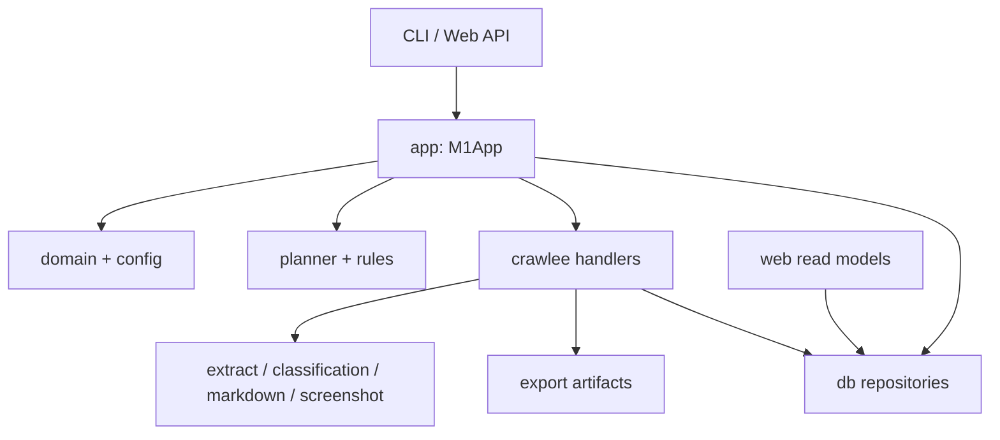
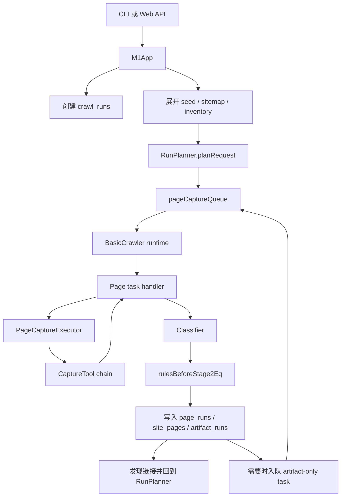
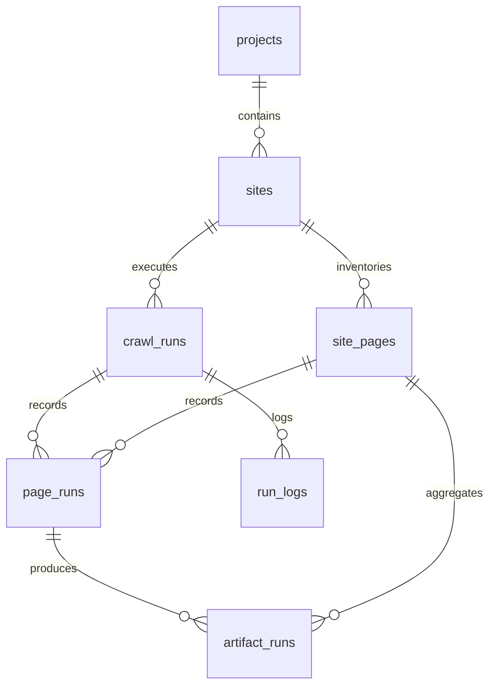

# 技术与模块结构说明

## 1. 系统总览

Kvault Web Capture 是一个本地运行的可交互网页采集系统。核心能力是围绕“项目 / 站点 / 页面清单 / 运行批次”管理网页发现、分类、规则判定、Markdown 采集、截图采集和结果预览。

### 1.1 入口形态

系统目前有两个入口：

- CLI：`src/cli.ts`，直接调用应用服务，适合脚本、调试和无头环境。
- Web：`src/web/server.ts` + `src/web/frontend`，Fastify 提供 REST API 和前端静态产物，前端是 React 控制台。

两者共享同一个核心应用服务 `M1App`，因此 CLI 和 Web 的业务行为应尽量保持一致。

### 1.2 技术栈

- Runtime：Node.js + TypeScript ESM
- 爬虫运行时：Crawlee `BasicCrawler` + run-scoped `RequestQueue`
- 基础页面抓取：`HttpBaseTool`
- Markdown 抓取：`MarkdownTool` + `Defuddle` / Lightpanda / Jina fallback
- 截图抓取：`PlaywrightScreenshotTool`
- 数据库：`node:sqlite` 的 `DatabaseSync`
- Web 后端：Fastify
- Web 鉴权：内存 Session + HTTP-only Cookie
- 前端：React 18 + Vite + React Router v6 + Tailwind CSS + shadcn/ui/Radix + Framer Motion
- 测试：Vitest

### 1.3 顶层模块地图

```text
src/
  cli.ts               CLI 命令入口
  app/                 应用服务编排层
  domain/              跨模块共享领域类型
  config/              站点配置解析、校验、默认配置
  planner/             启动 URL 展开、入队规划、更新策略
  rules/               URL / label 规则判定
  capture/             PageCaptureExecutor、CaptureTool、captools 与 HTML 解析工具
  crawlee/             Crawlee runtime、单队列工厂、page task handler
  classification/      页面分类接口
  export/              artifact 文件写入
  db/                  SQLite schema 与 repository
  web/                 Web API、读模型、运行协调器、前端说明
```

### 1.4 分层关系



可以把系统理解为四层：

- 接入层：CLI 和 Web API。
- 编排层：`M1App`，负责把配置、数据库、队列和 crawler 串起来。
- 执行层：Planner、Rules、Crawlee handlers、各种 capture adapter。
- 状态层：SQLite 业务状态 + Crawlee storage 执行状态 + 文件系统 artifact。

## 2. 核心领域模型

这一章先解释项目中的名词，再解释这些名词如何落到数据库和 TypeScript 类型上。

### 2.1 业务实体

核心类型在 `src/domain/types.ts`。

- `Project`：项目，组织多个站点。
- `Site`：采集配置和存储边界。
- `SiteConfig`：站点配置，包括 seed、sitemap、规则和深度选项。
- `RunType`：`seed_run`(初步摸底) 或 `crawl_run`(正式采集)。
- `SitePage`：站点页面清单中的去重页面。
- `PageRun`：某次运行中某页面的 `base抓取`和规则判定结果。
- `ArtifactRun`：某次运行中某页面的 markdown / screenshot 抓取结果。

### 2.2 页面状态

`site_pages.inventory_status` 是页面在站点级清单里的聚合状态：

- `discovered_only`：已发现但还没有`base抓取`结果。
- `url_rule_denied`：在 base 抓取前被 URL 规则排除。
- `base_captured`：已完成 base，且没有需要继续采集的 artifact。
- `stage2_pending`：需要人工或规则进一步确认。
- `stage2_skipped`：base 后判定不需要继续采集。
- `stage2_captured`：所需 artifact 均已成功。

Pending 原因：

- `classifier_failed`
- `rule_unmatched`
- `seed_run`

### 2.3 站点配置

`src/config/site-config.ts` 负责 JSON 配置解析和校验。配置结构：

```json
{
  "seedUrls": [],
  "sitemaps": [],
  "rulesBeforeBaseEq": [],
  "rulesBeforeStage2Eq": [],
  "runOptions": {
    "seedMaxDepth": 1,
    "crawlMaxDepth": 2
  }
}
```

### 2.4 规则模型

规则有两个执行点：

- `rulesBeforeBaseEq`：只支持 URL 规则，在进入 base 队列之前执行，默认 allow。
- `rulesBeforeStage2Eq`：支持 URL 规则和 label 规则，在 base + 分类之后执行，默认 pending。

规则固定优先级：

1. blacklist 命中则 deny
2. scopelist 必须全部匹配，否则 deny
3. whitelist 命中则 allow，并合并 `artifacts`
4. 使用执行点默认结果

规则判定实现在 `src/rules/rule-decision.ts`。如果后续要增加规则类型、条件操作符或 artifact 选择策略，优先从这个文件和 `SiteConfig` 类型开始。

规则 JSON 的编写方式见 [规则格式编写指南](./rule-format-guide.md)。

## 3. 运行时架构

运行时的主链路由 `M1App` 编排，Crawlee 负责单队列调度和底层 HTTP 能力，`PageCaptureExecutor` 负责调用具体 `CaptureTool`，SQLite 负责业务状态，文件系统负责保存实际 artifact。

### 3.1 主链路图



### 3.2 应用服务编排

`src/app/services.ts` 中的 `M1App` 是核心编排入口。它负责：

- 打开并初始化 SQLite schema
- 构造 repositories
- 创建项目和站点
- 读取、更新、导入、克隆站点配置
- 创建运行批次
- 打开 Crawlee run-scoped `pageCaptureQueue`
- 展开启动 URL
- 创建 `CrawleeCaptureRuntime`、`PageCaptureExecutor` 和内置 tools
- 执行单个 `BasicCrawler` runtime
- 刷新运行统计并结束运行

默认依赖：

- 分类器：`FakeClassifier`
- Capture tools：`HttpBaseTool`、`MarkdownTool`、`PlaywrightScreenshotTool`

### 3.3 URL 发现与入队规划

URL 归一化由 `normalizeUrl` 提供，主要处理：

- 去掉 fragment
- host 小写
- 移除 `utm_*`
- query 参数排序
- 非根路径去掉尾部 `/`

`src/planner/startup-url-expander.ts` 会合并三类启动候选：

- `seedUrls`
- 递归解析后的 sitemap 页面 URL
- `crawl_run` 时已有 inventory URL

同一轮启动候选按原始 URL 去重。运行中页面链接发现也会回到同一个 `RunPlanner.planRequest(...)` 路径，因此启动 URL 和运行中发现 URL 使用同一套 URL 规则、历史状态和 update policy。

### 3.4 `seed_run`

`seed_run` 的目的不是产出最终 artifact，而是建立页面清单并帮助用户调整规则。

- update policy 固定为 `force_recrawl_all`
- 只执行 base crawler
- markdown / screenshot 队列会创建但不会运行
- 即使命中 allow，最终也会改成 `stage2_pending`，`pending_reason = seed_run`
- 页面链接递归深度受 `runOptions.seedMaxDepth` 控制

### 3.5 `crawl_run`

`crawl_run` 用于正式产出 Markdown 和截图。

- 启动候选 = seed + sitemap + 已知 inventory
- base crawler 先运行
- base handler 根据规则和 update policy 决定是否加入 markdown / screenshot 队列
- markdown crawler 再运行
- screenshot crawler 最后运行
- 页面链接递归深度受 `runOptions.crawlMaxDepth` 控制

### 3.6 Update Policy

`src/planner/update-policy.ts` 控制历史页面是否再次进入 base / artifact 队列：

- `force_recrawl_all`：总是重新抓。
- `skip_existing`：已有完整成功结果时跳过；配置变化、pending、失败、缺少 artifact 时重新抓。
- `stale_after_duration`：base 或所需 artifact 超过 `staleAfterMs` 时重新抓。

`targetSuccessCount` 是软上限。达到目标后，page task handler 会停止继续扩展新链接，并跳过后续多余 base task；已并发开始或已入队的 artifact task 仍会完成，所以最终成功数可能略高于目标。成功数以 `RunRepository.refreshCounts` 的完整 artifact 口径为准。

## 4. 执行子系统

这一章按“运行时实际做事的模块”组织。修改采集行为时，通常先看这里。

### 4.1 Crawlee runtime 与 page capture 队列

`src/crawlee/queue-factory.ts` 为每次 run 创建单一队列：

- `run-{runId}-page-capture`

队列中的业务载荷是 `PageCaptureTask`。task 通过 `needs` 声明本次需要的能力：

- `['base']`：基础抓取、链接发现、分类和 stage2 规则。
- `['markdown']` / `['screenshot']`：为已存在 `pageRunId` 补抓 artifact。
- `['base', 'markdown', 'screenshot']`：允许 executor 一次性抓取多种能力，但 handler 仍会先执行 base 决策，再决定是否接受 artifact。

`src/crawlee/capture-runtime.ts` 用 `BasicCrawler` 调度该队列，并把 Crawlee 的 `sendRequest`、session、proxyInfo 包装成项目内的 `RuntimeContext`。

### 4.2 Request handlers

`src/crawlee/handlers.ts` 是 Crawlee 侧最重要的业务入口。它不直接决定用 HTTP、Defuddle、Lightpanda、Jina 还是 Playwright 抓取，而是调用 `PageCaptureExecutor`。

`needs` 包含 `base` 的 task 负责：

- 提取页面基础信息
- 调用分类器
- 执行 stage2 规则
- 写入 base capture 文件
- 创建 `page_runs`
- 更新 `site_pages`
- 为 `crawl_run` 规划 artifact-only task
- 发现页面链接并重新交给 `RunPlanner`

artifact-only task 负责：

- 调用 executor 抓取 markdown / screenshot
- 写入 artifact 文件
- 创建 `artifact_runs`
- 更新 `site_pages` 聚合状态
- 写入 run log

失败处理器会在 Crawlee retries 耗尽后写入 failed 结果和日志。

### 4.3 Capture executor 与内置 tools

`src/capture/executor.ts` 中的 `PageCaptureExecutor` 按 task `needs` 选择可覆盖剩余能力的 tool，保留部分成功结果，并在能力未满足时返回清晰错误。

阶段一内置 tools 在 `src/capture/captools/`：

- `HttpBaseTool`：通过 `RuntimeContext.sendRequest` 获取 HTML，并解析 title、meta、body text 和 links。
- `MarkdownTool`：按 `DefuddleMarkdownStrategy`、`LightpandaMarkdownStrategy`、`JinaMarkdownStrategy` 顺序 fallback。
- `PlaywrightScreenshotTool`：自己创建 page、导航和截图。

### 4.4 分类

分类接口是 `Classifier.classify(page)`。当前默认 `FakeClassifier` 基于 title/meta 的关键词返回 `content_type`，并对部分 Apple iPhone URL 做特殊分类。

### 4.5 页面提取与内置工具

`src/capture/html.ts` 从 HTML 中提取：

- title
- meta description
- body text
- 页面链接

链接提取会跳过：

- fragment-only href
- 非 http / https 协议
- 带非 HTML 扩展名的资源文件

`src/capture/captools/markdown-tool.ts` 默认使用 fallback 策略：

1. `DefuddleMarkdownStrategy`：需要 LinkeDOM document
2. `LightpandaMarkdownStrategy`：调用 `lightpanda fetch --dump markdown`
3. `JinaMarkdownStrategy`：需要 `JINA_API_TOKEN`

`src/capture/captools/playwright-screenshot-tool.ts` 默认使用 Playwright 全页 PNG。

### 4.6 Artifact 文件存储

`src/export/file-artifact-writer.ts` 将输出写到站点 `storageRoot` 下：

```text
{storageRoot}/artifacts/run-{runId}/page-{sitePageId}/base.md
{storageRoot}/artifacts/run-{runId}/page-{sitePageId}/markdown.md
{storageRoot}/artifacts/run-{runId}/page-{sitePageId}/screenshot.png
```

SQLite 中会保存 `output_path`；markdown 文本也会保存到 `artifact_runs.content`，截图只保存文件路径。

## 5. 状态与持久化

### 5.1 状态分工

- SQLite 保存业务状态、历史结果、统计、日志和 artifact 索引。
- Crawlee storage 保存运行队列、请求重试和 Crawlee 自身执行状态。
- 文件系统保存 base / markdown / screenshot 等实际产物。

这个分工很重要：不要在应用层再实现一套和 Crawlee 竞争的运行队列；也不要把业务查询建立在 Crawlee storage 内部结构上。

### 5.2 SQLite Schema

Schema 在 `src/db/database.ts`。主要表：

- `projects`
- `sites`
- `crawl_runs`
- `site_pages`
- `page_runs`
- `artifact_runs`
- `run_logs`

关系概览：



### 5.3 Repositories

Repository 被拆分在 `src/db/repositories/`：

- `ProjectRepository`
- `SiteRepository`
- `RunRepository`
- `SitePageRepository`
- `PageRunRepository`
- `ArtifactRunRepository`
- `RunLogRepository`

写路径主要由 `M1App` 和 Crawlee handlers 调用 repository。Web 页面需要的聚合读取不要直接塞进 repository；当前放在 `src/web/queries/read-models.ts`。

## 6. 接入层

### 6.1 CLI

`src/cli.ts` 只负责解析命令行参数并调用 `M1App`。主要命令包括：

- `project:create`
- `site:create`
- `site:import-config`
- `site:clone-config`
- `run:seed`
- `run:crawl`
- `site:inventory-summary`
- `site:pending`
- `site:denied`
- `site:sample-captures`

还有一个 `spike` 命令用于集成冒烟流程。

### 6.2 Web 后端

`src/web/server.ts` 创建 Fastify server。

主要组成：

- `M1App`：写路径和运行入口
- 只读 SQLite connection：供 read model 查询
- `SessionAuth`：管理密码登录和 cookie session
- `RunCoordinator`：限制同一站点并发和全局最大并发
- `read-models.ts`：为前端提供业务化视图

Web API 的 run 启动是异步的：接口触发 `RunCoordinator.startSeed/startCrawl` 后立即返回最新 run 信息，实际采集在后台 promise 中继续执行。

### 6.3 Web 前端

参考 `src/web/frontend/README.md`：

- 前端是 React SPA。
- 业务页面围绕 Projects、Sites、Site Dashboard 展开。
- Site Dashboard 包含 Overview、Config、Pipeline、Pages 等核心模块。
- 前端不直接操作数据库，通过 `/api/*` 调用 Fastify 后端。
- 生产模式下，后端读取并提供 `src/web/frontend/dist` 中的打包产物。

## 7. 接手与修改指南

### 7.1 常见修改入口

- 修改 CLI 行为：从 `src/cli.ts` 开始，但业务逻辑应落到 `M1App` 或更下层模块。
- 修改站点配置结构：先改 `src/domain/types.ts` 和 `src/config/site-config.ts`。
- 修改规则判定：看 `src/rules/rule-decision.ts`，再同步测试。
- 修改 URL 入队和历史跳过：看 `src/planner/run-planner.ts` 和 `src/planner/update-policy.ts`。
- 修改页面抓取流程：看 `src/crawlee/handlers.ts` 和 `src/crawlee/crawler-factory.ts`。
- 修改数据库写入：看 `src/db/database.ts` 和 `src/db/repositories/`。
- 修改 Web 展示数据：优先看 `src/web/queries/read-models.ts`。
- 修改 Web 运行触发：看 `src/web/server.ts` 和 `src/web/services/run-coordinator.ts`。
